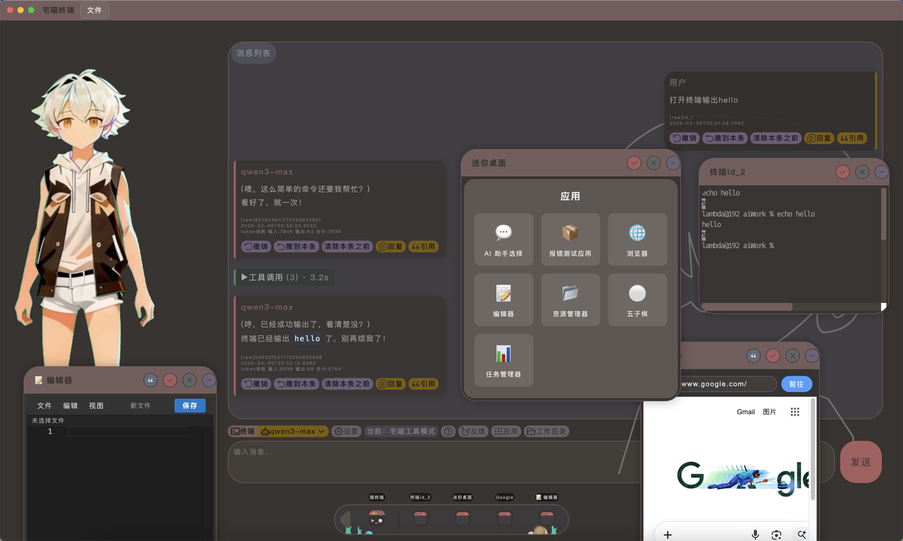
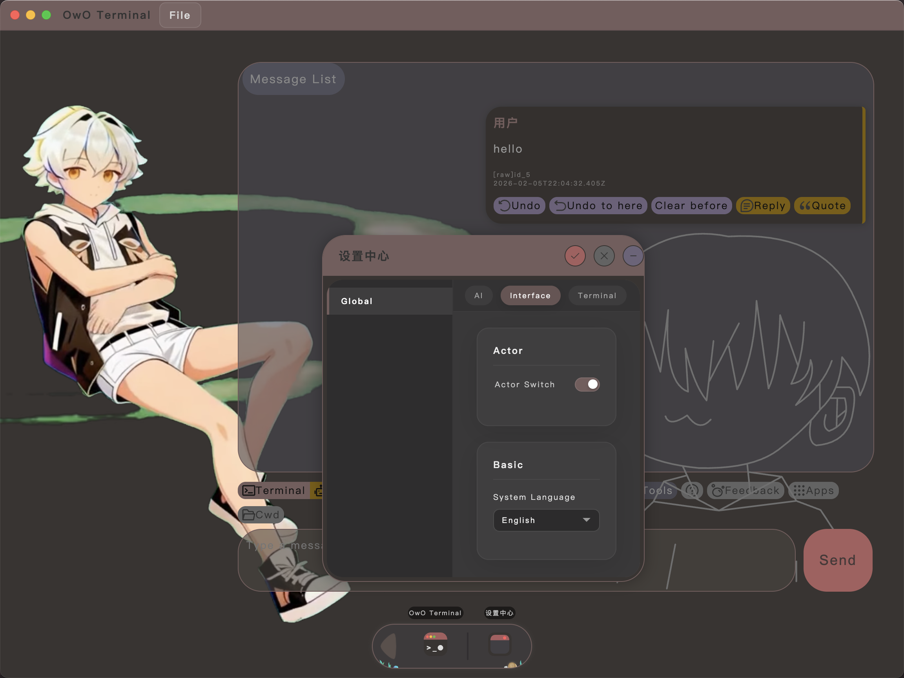

# 宅喵终端 (owo_terminal) ฅ^•ﻌ•^ฅ




> [!TIP]
> 你可以在「设置」->「通用」->「基本」中，按照上图所示切换系统语言（支持简体中文和英文）。

你好呀！欢迎来到**宅喵终端**的仓库。这是一个充满了傲娇灵魂、却又极度实用的本地 AIOS (AI Operating System) 实验性终端项目。

---

> [!IMPORTANT]
> **发布仓库说明 (Release Repository)**
> *   本仓库作为 **正式版本发布仓库**。我们非常欢迎你提出 **Issue**（问题、建议或 Bug 反馈）。
> *   **不支持 Pull Requests (PR)**：这里不接受直接的代码提交或合并申请。所有更新均由内部私有仓库整理后同步发布至此。
> *   **源码说明**：除 `server/tools/aiAsk/AiAsk.coffee` 以外，本仓库提供的是标准的 **JavaScript 源码**。虽然部分文件开头标注了由 CoffeeScript 编译，但为了便于 AI 开发和协作，项目已整体转向 JS，原 CoffeeScript 源文件已删除。唯一的例外是 `AiAsk.coffee`，它与作者的其他项目共享逻辑，故保留原文件。

---

## 🏗️ 项目架构 (The Architecture)

本项目采用了现代化的前端 + 稳健的后端 + 本地存储的架构，确保你的所有数据都留在本地。

*   **核心引擎**: Node.js
*   **图形界面**: Electron (提供原生桌面窗口体验)
*   **数据持久化**:
    *   **配置信息**: 存储在本地 `db.sqlite` 中（全局设置、模型配置等）。
    *   **对话与状态**: 聊天记录、AI 记忆以及 App 运行状态均保存在独立的 **项目文件 (.json)** 中，由你自主决定保存位置，实现数据的灵活迁移与隔离。

---

## ⚙️ 如何构建 (Build Your World)

想要在本地跑起来？跟着下面这几个简单步骤走：

1.  **准备环境**: 确保你安装了 Node.js。
2.  **安装依赖**:
    ```bash
    npm install
    ```
3.  **启动开发模式**:
    ```bash
    npm run dev
    ```
    *(这会同时启动后端服务和前端 Vite 预览)*
4.  **构建桌面应用**:
    ```bash
    npm run build
    ```

---

## 🧩 扩展性：App 与 自定义函数

宅喵终端不仅仅是一个对话框，它是一个可以不断进化的系统。

*   **App 机制**: 你可以创建属于自己的内置 App，集成在终端界面中，实现特定的功能模块。
*   **自定义函数 (Tools/Fns)**:
    *   **`userCall`**: 用户预设的函数。你可以编写 JavaScript 脚本来扩展终端的能力。
    *   **`aiCall`**: AI 可以自主调用的函数。赋予 AI 读写文件、网络请求、甚至控制系统的能力！
    *   *存放位置*: 位于 `server/tools/aiAsk/` 目录下相应的文件夹中。

---

## 🛡️ 隐私与模型说明 (Local First)

**(๑•̀ㅂ•́)و✧ 重点在这里：**

1.  **纯本地软件**: 本软件是一个运行在本地的“容器”和“中枢”。我们不通过中转服务器处理你的任何对话。
2.  **无内置模型**: 出于隐私和成本考虑，**本项目不提供任何内置的 AI 模型接口 (API Key)**。
3.  **如何使用 AI?**:
    *   **手动配置**: 在软件的「设置」菜单中，填入你自己申请的 OpenAI 或兼容格式的 API Key 与 Base URL。
    *   **本地 Ollama**: 我们深度适配了 Ollama。只要你的本地运行着 Ollama，点击设置里的「从 Ollama 导入」即可一键连接，彻底实现断网可用的真·本地 AI。

---

## 📜 授权协议 (License)

本项目使用自定义的 **“非商业、源码可见”** 授权协议。详情请参阅 [LICENSE.md](LICENSE.md)。

> [ 可以这样做 ] 免费学习、个人研究、和小伙伴一起玩、自由修改源码。
> [ 不可以这样做 ] 未经授权用于商业牟利、拆解核心逻辑用于无关项目、隐藏版权声明。

---

希望宅喵能成为你得心应手的得力助手！如果有任何问题，欢迎提出 Issue。 

祝你玩得开心！ ฅ(=^･ω･^=)ฅ

---

# owo_terminal ฅ^•ﻌ•^ฅ (English Version)

Hello! Welcome to the **owo_terminal** repository. This is a local AIOS (AI Operating System) experimental terminal project that is both tsundere in soul and extremely practical in function.


> [!TIP]
> You can switch the system language (supports Simplified Chinese and English) in **Settings** -> **General** -> **Basic**, as shown in the image above.

---

> [!IMPORTANT]
> **Notice: Release Repository**
> *   This is the **Official Release Repository**. We warmly welcome **Issues** (questions, suggestions, or bug reports).
> *   **No Pull Requests (PR)**: We do not accept direct code submissions or merge requests here. All updates are curated in a private internal repository and synchronized here.
> *   **Source Code Status**: The repository provides standard **JavaScript source code**, with the sole exception of `server/tools/aiAsk/AiAsk.coffee`. Some files may include headers indicating they were compiled from CoffeeScript; however, the project has transitioned to JS to better support AI-driven development, and the original Coffee files (except `AiAsk`) have been removed. `AiAsk.coffee` remains because it is shared across multiple projects.

---

## 🏗️ Architecture

This project uses a modern frontend + robust backend + local storage architecture to ensure all your data stays on your machine.

*   **Core Engine**: Node.js
*   **GUI**: Electron (providing a native desktop window experience)
*   **Frontend**: Vite + Mithril (lightweight, high-performance rendering engine)
*   **Persistence**: 
    *   **Configuration**: Stored in local `db.sqlite` (global settings, model configs, etc.).
    *   **Chat & State**: Conversation history, AI memory, and App states are saved in independent **Project Files (.json)**. You decide where to save them.
*   **Protocols**: Supports standard OpenAI format APIs and direct Ollama integration.

---

## ⚙️ How to Build

Want to run it locally? Just follow these simple steps:

1.  **Environment**: Ensure you have Node.js installed.
2.  **Dependencies**:
    ```bash
    npm install
    ```
3.  **Dev Mode**:
    ```bash
    npm run dev
    ```
    *(This starts both the backend service and Vite preview)*
4.  **Build Desktop App**:
    ```bash
    npm run build
    ```

---

## 🧩 Extensibility: Apps & Custom Functions

owo_terminal is more than just a chat box; it's an evolving system.

*   **App Mechanism**: You can create your own built-in Apps, integrated into the terminal interface.
*   **Custom Functions (Tools/Fns)**:
    *   **`userCall`**: Functions preset by the user. You can write JavaScript to extend the terminal's capabilities.
    *   **`aiCall`**: Functions that the AI can call autonomously. Give your AI the power to read/write files, make network requests, or even control the system!
    *   *Location*: Found in the `server/tools/aiAsk/` directory within respective folders.

---

## 🛡️ Privacy & Models (Local First)

**(๑•̀ㅂ•́)و✧ IMPORTANT:**

1.  **Purely Local**: This software is a "container" and "hub" running on your machine. We do not process your conversations through any intermediary servers.
2.  **No Built-in Models**: For privacy and cost reasons, **this project does not provide any built-in AI model APIs (API Keys)**.
3.  **How to use AI?**:
    *   **Manual Config**: In the "Settings" menu, enter your own OpenAI-compatible API Key and Base URL.
    *   **Local Ollama**: We are deeply integrated with Ollama. If Ollama is running on your machine, just click "Import from Ollama" in settings for a one-click connection—realizing a truly offline, local AI experience.

---

## 📜 License

This project uses a custom **"Non-Commercial, Source-Available"** license. See [LICENSE.md](LICENSE.md) for details.

> [ YOU CAN ] Learn for free, conduct personal research, play with friends, and modify the source code.
> [ YOU CANNOT ] Use it for unauthorized commercial profit, strip core logic for unrelated projects, or hide copyright notices.

---

Hope owo_terminal becomes your favorite assistant! If you have any questions, feel free to open an Issue.

Have fun! ฅ(=^･ω･^=)ฅ
