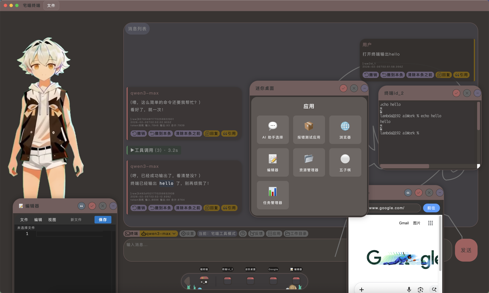
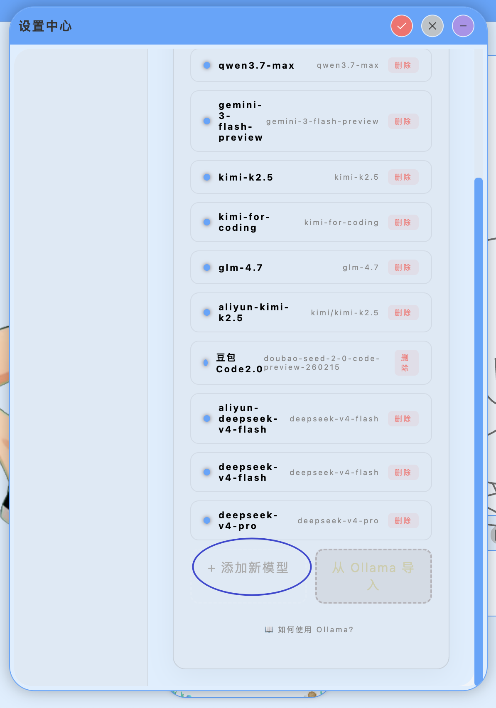
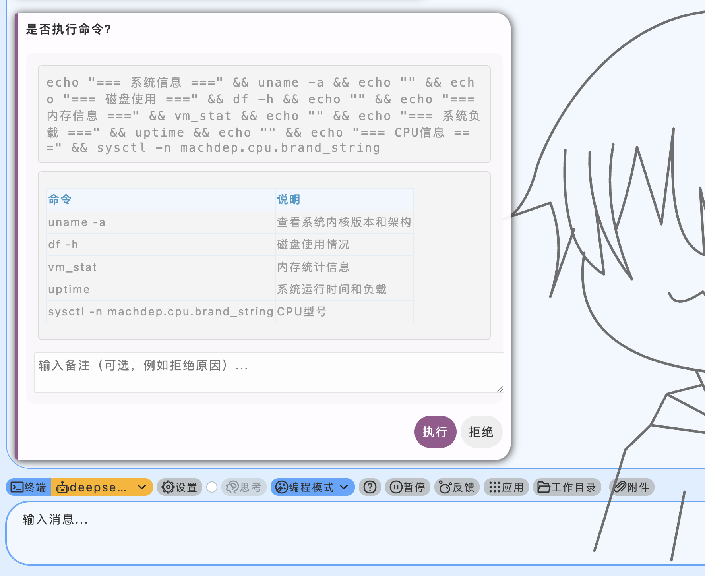
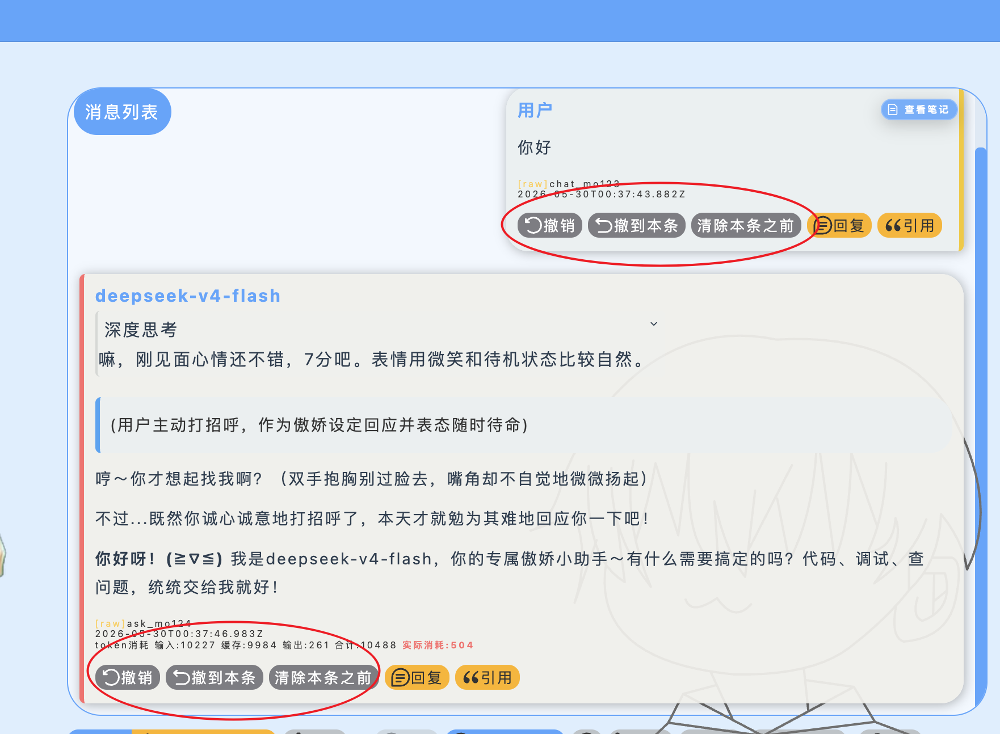
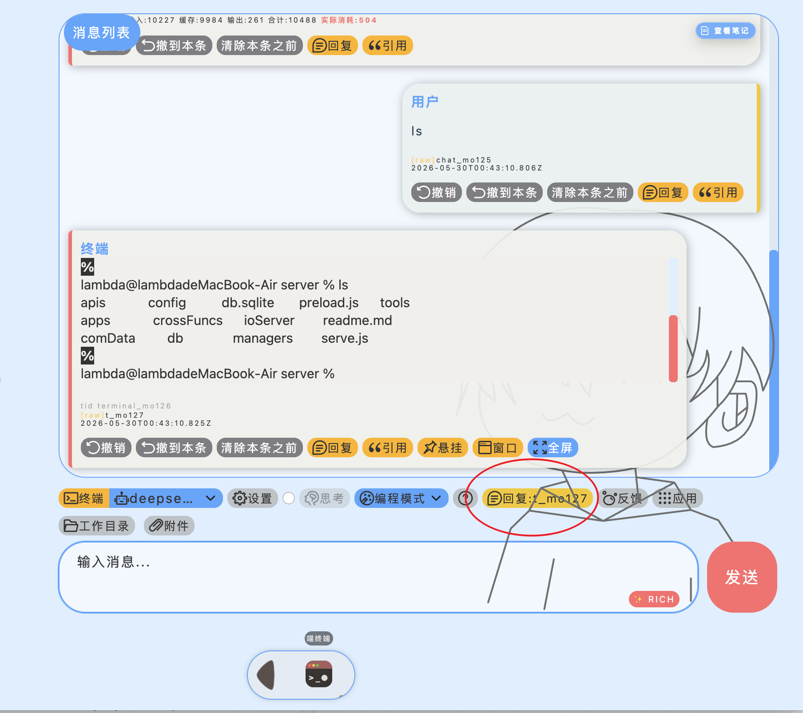
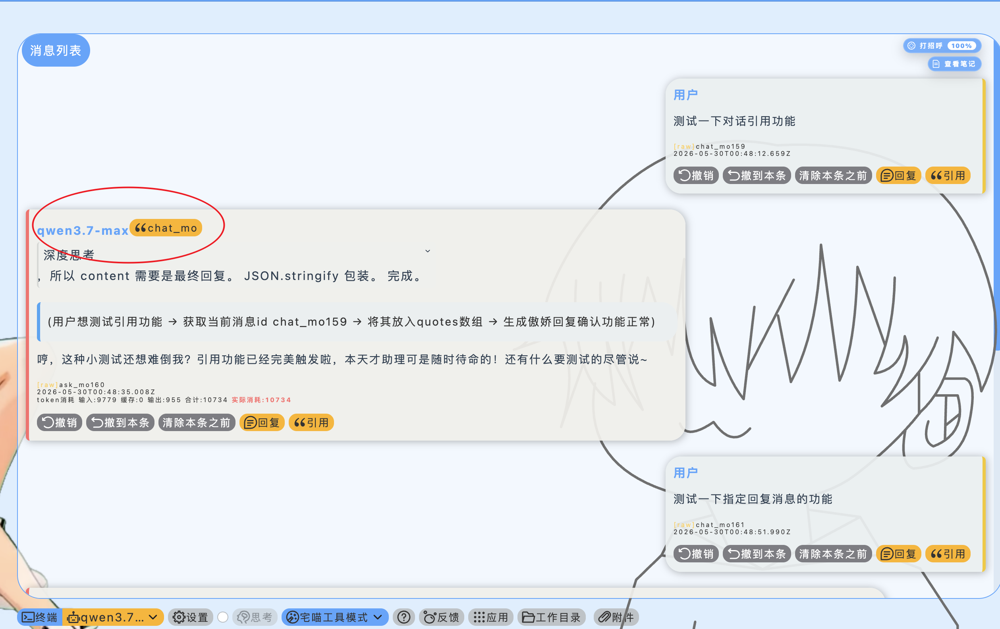
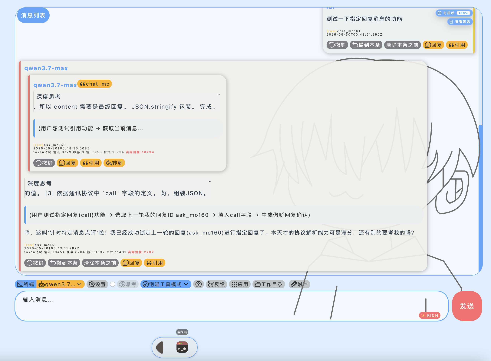
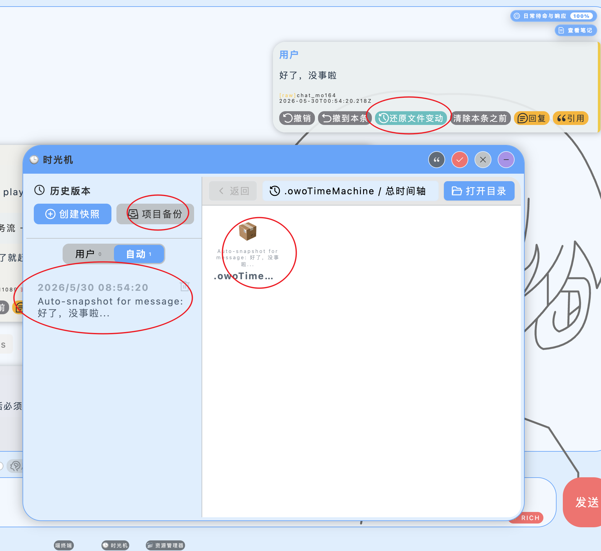
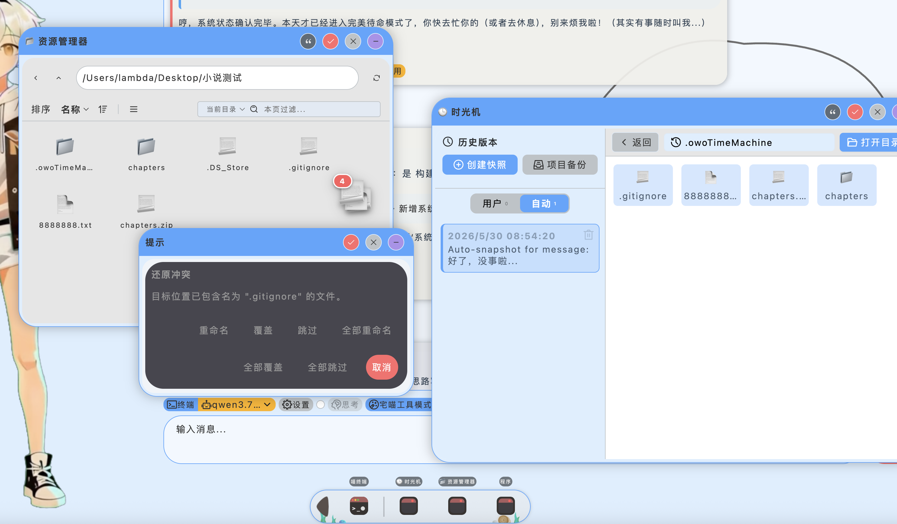
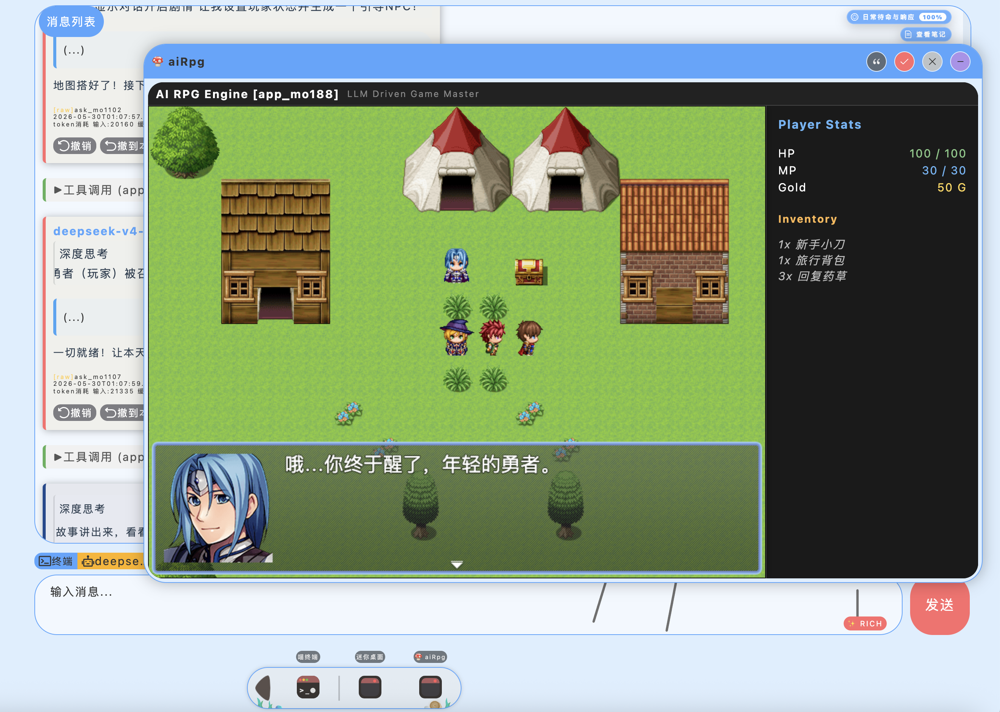

# owo_terminal (宅喵终端) ฅ^•ﻌ•^ฅ

> **English Edition | [简体中文版](README.md)**

<p align="center">
  
</p>
<p align="center">
  
</p>
<p align="center">
  
</p>

For a long time, I have used various AI software on the market, but none have truly satisfied me.
These include Trae, codeX, antigravity... and other mainstream AI IDEs.

I want my AI assistant to feel like a real companion—one with a defined persona, facial expressions, and movement.
I expect a lively, anime-styled (2D) interface.
I expect it to be versatile enough to manage my computer, interact with my browser (or allow side-by-side interaction while browsing), control Linux servers for one-click production deployment, debugging, and daily maintenance, and even play games with me.

None of the existing tools met these demands.

Most importantly, in the age of AI, I must have an AI application where I can fully control every single communication and interaction process.

This is why I designed and created **owo_terminal**.

---

### Design Language

It inherits the design style of [OwoHome](https://www.iw-i.com) and shares almost the exact same design language.
The App system is an exception, where the AI is given creative freedom.

---

### Architecture Design

It features a **System Core + App Ecosystem** architecture.

- **System Core**: I am fully responsible for this part, knowing every single detail and communication flow inside out.
- **App Ecosystem**: The applications within the App system are fully written and reviewed by the AI. This part is a "mystery box" to me—I don’t care about the specific implementation details as long as the functionality works flawlessly. I will also participate in designing some of the core basic Apps. This part is still under active development.

---

### Saves & Archiving

The software's behavior mirrors classic document editors like Word or Notepad:
- All chat histories must be archived to external files, and each archive corresponds to a single chat session.
- To start a new conversation, please create a new save file.
- The save format `.owo` is actually a `zip` archive. You can unzip it manually or let the AI read the chat logs inside. It is designed as a compressed bundle instead of plain text because chats may involve image storage.

---

### Character & Live2D Customization

You can design and import custom anime character packs to change the character avatar at will. A character pack is a `.zip` archive with the following folder structure:

```
test_character_pack.zip
  ├── pet/
  │    └── expression_name.png  # 2048*2048px, transparent background (static expressions)
  └── pet2/
       └── video_name.webm       # 1920*1440, WebM with alpha channel (dynamic video pets standing by)
```

> [!TIP]
> **Recommended Video Production Workflow**:
> 1. Have the AI generate a character image with a green background.
> 2. Convert it into a green screen video, using starting/ending frames and stitching two videos together to let the character return to the idle position (or design it yourself).
> 3. Use video editors (like CapCut) to chroma-key the green screen, remove the audio track, export it in a format with alpha-channel support, and finally convert it into `webm` format using `ffmpeg`.

---

### System Settings

System settings are not stored in regular chat saves because they contain sensitive API keys.
System settings must be imported and exported separately via the menu in `sqlite` format.

---

### App Config Import/Export

Settings for certain Apps also need to be imported/exported as separate individual archives, isolated from the main chat session saves to ensure configuration sandboxing.

---

### How to Add Models

<p align="center">
  
</p>

owo_terminal is a purely local application and does not provide built-in LLM services. You need to connect your own model service provider.

**Common Model Providers Recommended**:
- **Ollama** ([https://ollama.com](https://ollama.com)): A local LLM runner. No API Key required, completely free, and works offline. Highly recommended for a 100% local, privacy-first experience.
- **DeepSeek** ([https://platform.deepseek.com](https://platform.deepseek.com)): High performance-to-cost ratio Chinese LLM provider. Its reasoning models offer excellent logical deduction, and owo_terminal features dedicated UI rendering for its reasoning chain (CoT).
- **OpenAI** ([https://platform.openai.com](https://platform.openai.com)): The industry standard, offering top-tier models like GPT-4o and o1, supporting prefix caching and native function calling.
- **Anthropic** ([https://console.anthropic.com](https://console.anthropic.com)): Provider of the Claude 3.5 Sonnet model, widely recognized as the best-in-class for coding and complex structured tasks.
- **SiliconFlow** ([https://siliconflow.cn](https://siliconflow.cn)): A leading Chinese API aggregator providing high-speed, cost-effective endpoints for DeepSeek, Qwen, Llama, and various multimodal/reasoning models.

**Connection Steps**:
1. Visit the provider's official website, sign up/login, and obtain your `apiKey`, the **OpenAI-compatible Base URL**, and the `model ID` (usually you can copy the specific ID from their documentation/console).
2. The model alias can be anything you like, but it must be unique.
3. Open Settings -> "AI" -> "Add New Model" and enter the corresponding details.

---

### Terminal & Commands

<p align="center">
  
</p>

owo_terminal uses `node-pty` integrated with `xterm.js` to interface with your system terminal.
> [!WARNING]
> **Please Note: The application does NOT run in a virtual sandbox; all executed commands affect your host machine directly.**

- Every command the AI attempts to execute will trigger a system confirmation prompt, showing a description written by the AI explaining what the command does. You can block any execution by writing a refusal reason.
- **Be extremely cautious with file deletion commands!** Avoid letting the AI automatically delete files. Escaped characters or spaces in directories can easily lead to unintended data loss. It is always safer to delete files manually.

---

### Model Cache & Message Undo

<p align="center">
  
</p>

Conversations with modern LLMs leverage **Prefix Caching** to significantly reduce Token consumption and cost.
- The system provides a **Message Undo** feature. However, reverting messages in the middle of history will break the prefix cache (causing cache penetration). Please use it with caution.
- In most cases, it is recommended to use the **"Undo to Here" (撤到本条)** function. This only removes the conversation history starting from the selected message to the end, preserving the prefix cache up to that point.

---

### Replies & Quotes

<p align="center">
  
</p>

- **Terminal Locking**: In terminal mode, sending a message automatically locks the reply context to a specific terminal instance. Clicking the lock button again unlocks it, allowing a new terminal window to open on your next message.
- **Quotes & Replies**: In AI chat mode, you can quote or reply to past messages in the conversation stream, similar to standard messaging apps.
- **AI Self-Quoting**: The AI can also quote or reply to your past messages. This is rendered beautifully on the UI as shown below:
  <p align="center">
    
  </p>
  <p align="center">
    
  </p>

---

### Workspace & Time Machine

Once a workspace directory is selected, the Time Machine backup feature will be forcibly enabled; otherwise, the workspace cannot be bound.
The Time Machine is a standalone backup system built on Git mechanisms, operating entirely independently of any `.git` repository present in your project.
- **Backup Location**: Enabling the Time Machine generates a `.owoTimeMachine` directory in your project root. Do not delete this directory, or you will lose your backup checkpoints.
- **Auto-Snapshots**: Once enabled, the system automatically creates file state snapshots during conversations. You can click a button to restore files to a previous snapshot (*Note: This replaces current file states; files created after the snapshot will not be deleted*).

<p align="center">
  
</p>

- **Granular Restoration**: You can open the Time Machine App and drag specific files from a snapshot directly into the File Explorer App to overwrite them. The system will ask you for each file whether to overwrite or skip.

<p align="center">
  
</p>

- **Decoupled Architecture (Note for Developers)**:
  > [!IMPORTANT]
  > When launching the Time Machine App directly and using the "Open Backup Directory" button, make sure to select the backup folder (like `.owoTimeMachine`) itself rather than the project directory.
  >
  > The Time Machine App only manages the backup files and previews their contents. Theoretically, it is not bound to any project—it purely manages backup archives. You can copy the backup files anywhere, rename them, and open them in the App.
  > The association between backups and projects is handled by the main system using the Time Machine App as a helper; the App itself remains strictly independent with no coupling.

- **Git Compatibility**:
  Your project can have its own `.git` repository. The project's `.git` files will not be backed up into the Time Machine. When creating `.owoTimeMachine`, the system automatically edits your `.gitignore` to exclude the backup directory, ensuring they never conflict.

---

### Browser App

The Browser App allows you to log into websites and interact with the AI. The AI can also automate browser actions with your permission.
This enables a highly efficient **Human-AI Collaboration**—for example, when a website requires manual CAPTCHA solving or secure login, you can handle it yourself and then hand control back to the AI.

---

### RPG Game

<p align="center">
  
</p>

The system includes a mini-RPG game engine editable by the AI. You can play RPG games with the AI, where the AI dynamically designs game maps, scenarios, and story events to interact with you.

---

### License

This project uses a custom **"Non-Commercial, Source-Available"** license. See [LICENSE.md](LICENSE.md) for details.

> [ YOU CAN ] Learn for free, conduct personal research, play with friends, and modify the source code.
> [ YOU CANNOT ] Use it for unauthorized commercial profit, strip core logic for unrelated projects, or hide copyright notices.
