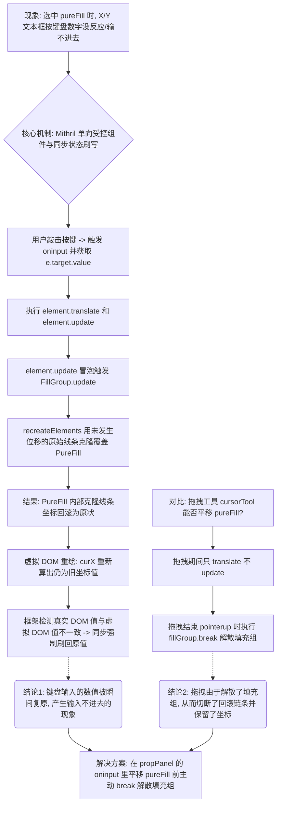
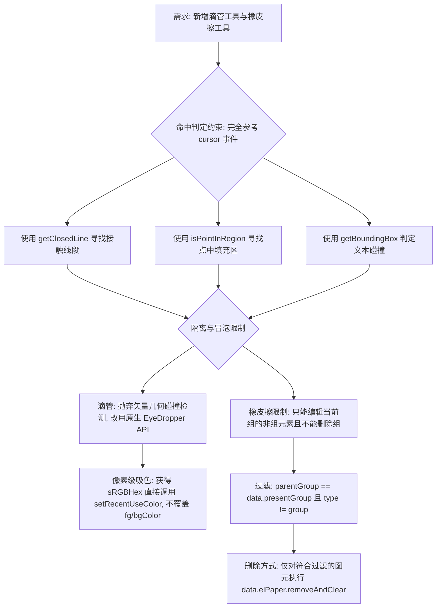

# 调查网点图记录

## 2026/07/25: 
## 2026/07/24 04:50 - 为什么属性面板中纯填充(pureFill)的X/Y坐标无法输入数字？



## 2026/07/24 05:08 - 新增滴管与橡皮擦工具的命中判定与限制



## 2026/07/20 17:40 - 为什么只有 TouchEvent 能让你在嵌套中写出缩放算法？

```mermaid
graph TD
    A[核心事实修正: gameEditor 确实在嵌套里写了双指 Pinch-Zoom 缩放算法!] --> B{目标: 解释为什么同样的嵌套缩放，在那边能跑通，在这边写不出来}
    
    B --> C[你那边的核心武器: TouchEvent API 的降维打击]
    C --> D[你在 rightOncreate.coffee 第 72 行用嵌套写出了 Math.sqrt]
    D --> E[关键在于: TouchEvent 的事件对象里，自带了 e.touches 数组]
    E --> F[当你触发任何一个 touchmove 时，浏览器会把当前屏幕上**所有的**手指坐标打包在这个数组里全交给你]
    F --> G[哪怕你处于一个为手指 A 注册的局部闭包里，只要 e.touches.length==2]
    G --> H[你可以瞬间摸到 e.touches[0] 和 e.touches[1]，算完距离万事大吉]
    H -.-> I(结论1: 你的嵌套能写缩放，全拜 e.touches 这个原生的'共享数据池'所赐)
    
    B --> J[当前 svgEditor 的困境: PointerEvent API 的相互隔离]
    J --> K[PointerEvent 规范要求：每根手指都是一个独立的指针实体]
    K --> L[这意味着每次触发 pointermove，事件对象 e 里面只有**这某一根手指**的数据]
    L --> M[如果你继续用嵌套，手指 A 拿不到手指 B 的数据，就像两个人在不同的房间打电话却不知道对方号码]
    M --> N[所以，要算距离，必须在外面手动搭建一个 activePointersMap (电话薄)]
    N --> O[有了 Map，大家就不能窝在各自的嵌套孤岛里，必须跑到外面的'广场' (平铺的 pointermove) 上去报备位置]
    O -.-> P(终极定论: PointerEvent 强制独立并发，想要跨指针算数学，就只能放弃嵌套闭包，回归平铺 Map)
```
