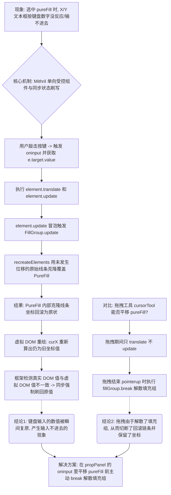
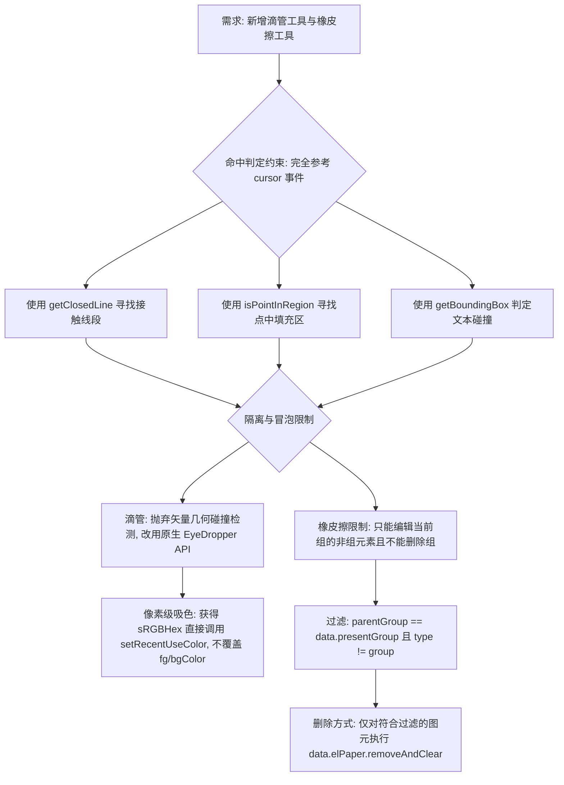
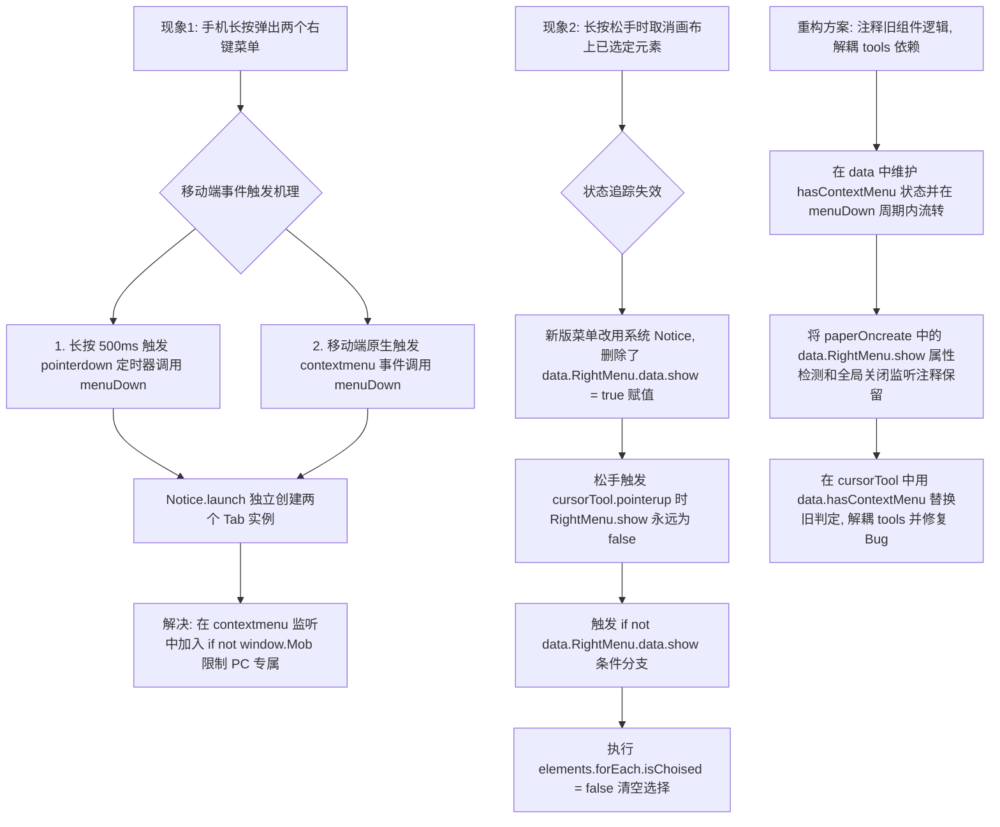

# 调查网点图记录

## 2026/07/25: 
## 2026/07/24 04:50 - 为什么属性面板中纯填充(pureFill)的X/Y坐标无法输入数字？

```mermaid
graph TD
    A[现象: 选中 pureFill 时, X/Y 文本框按键盘数字没反应/输不进去] --> B{核心机制: Mithril 单向受控组件与同步状态刷写}
    B --> C[用户敲击按键 -> 触发 oninput 并获取 e.target.value]
    C --> D[执行 element.translate 和 element.update]
    D --> E[element.update 冒泡触发 FillGroup.update]
    E --> F[recreateElements 用未发生位移的原始线条克隆覆盖 PureFill]
    F --> G[结果: PureFill 内部克隆线条坐标回滚为原状]
    G --> H[虚拟 DOM 重绘: curX 重新算出仍为旧坐标值]
    H --> I[框架检测真实 DOM 值与虚拟 DOM 值不一致 -> 同步强制刷回原值]
    I -.-> J(结论1: 键盘输入的数值被瞬间复原, 产生输入不进去的现象)
    
    K[对比: 拖拽工具 cursorTool 能否平移 pureFill?] --> L[拖拽期间只 translate 不 update]
    L --> M[拖拽结束 pointerup 时执行 fillGroup.break 解散填充组]
    M -.-> N(结论2: 拖拽由于解散了填充组, 从而切断了回滚链条并保留了坐标)
    
    J & N --> O[解决方案: 在 propPanel 的 oninput 里平移 pureFill 前主动 break 解散填充组]
```

## 2026/07/24 05:08 - 新增滴管与橡皮擦工具的命中判定与限制

```mermaid
graph TD
    A[需求: 新增滴管工具与橡皮擦工具] --> B{命中判定约束: 完全参考 cursor 事件}
    B --> C[使用 getClosedLine 寻找接触线段]
    B --> D[使用 isPointInRegion 寻找点中填充区]
    B --> E[使用 getBoundingBox 判定文本碰撞]
    
    C & D & E --> F{隔离与冒泡限制}
    F --> G[滴管: 抛弃矢量几何碰撞检测, 改用原生 EyeDropper API]
    G --> H[像素级吸色: 获得 sRGBHex 直接调用 setRecentUseColor, 不覆盖 fg/bgColor]
    
    F --> I[橡皮擦限制: 只能编辑当前组的非组元素且不能删除组]
    I --> J[过滤: parentGroup == data.presentGroup 且 type != group]
    J --> K[删除方式: 仅对符合过滤的图元执行 data.elPaper.removeAndClear]
```

## 2026/07/20 17:40 - 为什么只有 TouchEvent 能让你在嵌套中写出缩放算法？

```mermaid
graph TD
    A[核心事实修正: gameEditor 确实在嵌套里写了双指 Pinch-Zoom 缩放算法!] --> B{目标: 解释为什么同样的嵌套缩放，在那边能跑通，在这边写不出来}
    
    B --> C[你那边的核心武器: TouchEvent API 的降维打击]
    C --> D[你在 rightOncreate.coffee 第 72 行用嵌套写出了 Math.sqrt]
    D --> E[关键在于: TouchEvent 的事件对象里，自带了 e.touches 数组]
    E --> F[当你触发任何一个 touchmove 时，浏览器会把当前屏幕上**所有的**手指坐标打包在这个数组里全交给你]
    F --> G[哪怕你处于一个为手指 A 注册的局部闭包里，只要 e.touches.length==2]
    G --> H[你可以瞬间摸到 e.touches[0] 和 e.touches[1]，算完距离万事大吉]
    H -.-> I(结论1: 你的嵌套能写缩放，全拜 e.touches 这个原生的'共享数据池'所赐)
    
    B --> J[当前 svgEditor 的困境: PointerEvent API 的相互隔离]
    J --> K[PointerEvent 规范要求：每根手指都是一个独立的指针实体]
    K --> L[这意味着每次触发 pointermove，事件对象 e 里面只有**这某一根手指**的数据]
    L --> M[如果你继续用嵌套，手指 A 拿不到手指 B 的数据，就像两个人在不同的房间打电话却不知道对方号码]
    M --> N[所以，要算距离，必须在外面手动搭建一个 activePointersMap (电话薄)]
## 2020/07/20 17:40 - 为什么只有 TouchEvent 能让你在嵌套中写出缩放算法？
... (unchanged content)

## 2026/07/25 - SVG解析器补全线(closingLine)内存引用泄漏与二次平移变形

```mermaid
graph TD
    A[SVG 导入 polyline 带 fill 属性] --> B[svgParser 解析生成线段组 generatedLines]
    B --> C[判断 disSq > 0.0001 触发补全线 closingLine 逻辑]
    C --> D[原代码: points: [endPt, startPt]]
    D --> E[致命缺陷: 直接将 firstLine.s 与 lastLine.e 的内存对象指针赋值给 closingLine]
    
    E --> F[组平移 Group.translate 遍历所有子元素]
    F --> G[1. 平移 firstLine -> firstLine.s 坐标 + deltaX (移动 1x)]
    F --> H[2. 平移 lastLine -> lastLine.e 坐标 + deltaX (移动 1x)]
    F --> I[3. 平移 closingLine -> 因 points 共享内存引用, firstLine.s 与 lastLine.e 被再次加 deltaX (移动 2x!)]
    
    I --> J[结果: 共享端点被平移 2x 速度, 独享端点平移 1x 速度]
    J --> K[现象: 平移组时 3 条线长度随位移伸缩变形, 只有 1 条无共享端点的线正常]
    
    K --> L[修复方案: 深拷贝坐标 points: [{x: endPt.x, y: endPt.y}, {x: startPt.x, y: startPt.y}]]
    L --> M[解耦点对象内存引用 -> 所有人平移 1x 速度 -> 彻底恢复正常平移]
```

## 2026/07/26 - svgEditor 撤销重做架构的伪增量与纯补丁重构

```mermaid
graph TD
    A[历史记录需求: 节约撤销重做内存占用] --> B{前 AI 的废案设计 (缝合怪)}
    B --> C[使用 jsonpatch.compare 计算出 forward 和 reverse 补丁]
    B --> D[但又保留了对 elPaper 全量元素的 SvgSerializer.serializeElements]
    B --> E[最终在 historyDatas 中同时存入补丁与 10MB 的全量 snapshot]
    E -.-> F(结果: 假增量真冗余! 计算了补丁却没节约内存, 依然引发 V8 GC 压力)

    A --> G{我的纯血增量设计 (Pure Patch)}
    G --> H[record 拦截: 若 forward.length == 0, 极简防抖丢弃无效记录]
    G --> I[内存维护唯一一份 @lastSnapshot]
    G --> J[入栈: 坚决丢弃 snapshot, 仅推入 forward 与 reverse 补丁]
    
    J --> K[撤销重做]
    K --> L[对 @lastSnapshot 执行 jsonpatch.applyPatch]
    L --> M[反序列化后替换当前画布并重绘]
    
    J --> N[历史面板任意跳转]
    N --> O[废弃直接读取全量的 O(1) 蠢笨逻辑]
    N --> P[以当前 @lastSnapshot 状态为锚点, 沿着差分补丁链步进推演]
    P --> Q[在微秒内算出目标历史时刻全量, 实现 99% 的内存释放!]
```

## 2026/07/27 21:36 - 右键 Notice 菜单引起的松手取消选中与双菜单 Bug 溯源

```mermaid
graph TD
    A[现象1: 手机长按弹出两个右键菜单] --> B{移动端事件触发机理}
    B --> C[1. 长按 500ms 触发 pointerdown 定时器调用 menuDown]
    B --> D[2. 移动端原生触发 contextmenu 事件调用 menuDown]
    C & D --> E[Notice.launch 独立创建两个 Tab 实例]
    E --> F[解决: 在 contextmenu 监听中加入 if not window.Mob 限制 PC 专属]

    G[现象2: 长按松手时取消画布上已选定元素] --> H{状态追踪失效}
    H --> I[新版菜单改用系统 Notice, 删除了 data.RightMenu.data.show = true 赋值]
    I --> J[松手触发 cursorTool.pointerup 时 RightMenu.show 永远为 false]
    J --> K[触发 if not data.RightMenu.data.show 条件分支]
    K --> L[执行 elements.forEach.isChoised = false 清空选择]
    
    M[重构方案: 注释旧组件逻辑, 解耦 tools 依赖]
    M --> N[在 data 中维护 hasContextMenu 状态并在 menuDown 周期内流转]
    N --> O[将 paperOncreate 中的 data.RightMenu.show 属性检测和全局关闭监听注释保留]
    O --> P[在 cursorTool 中用 data.hasContextMenu 替换旧判定, 解耦 tools 并修复 Bug]
```
