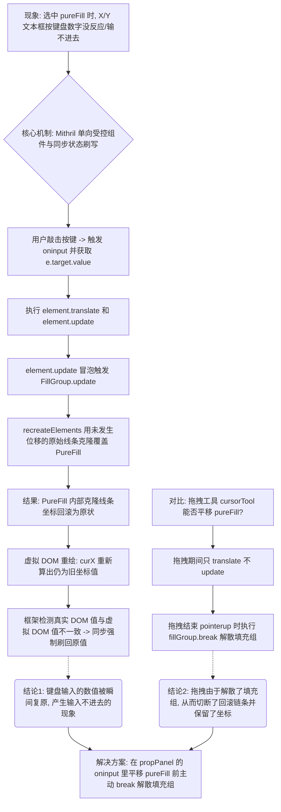
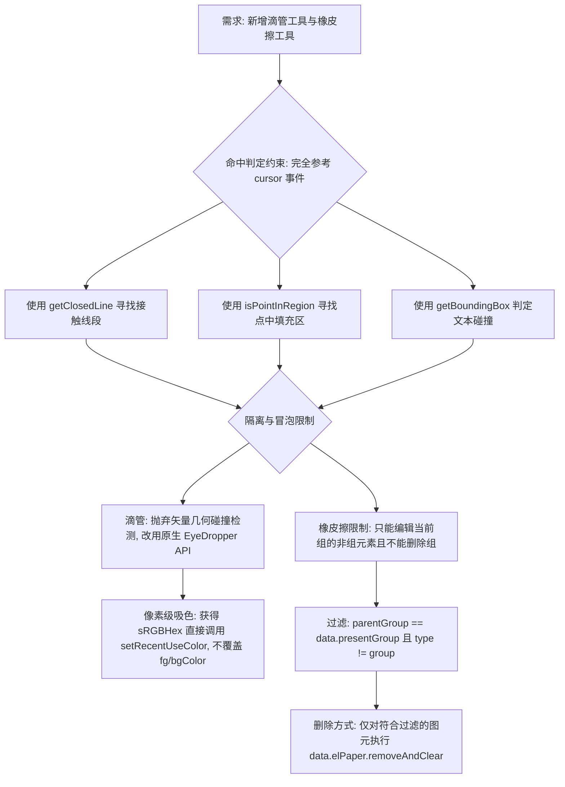
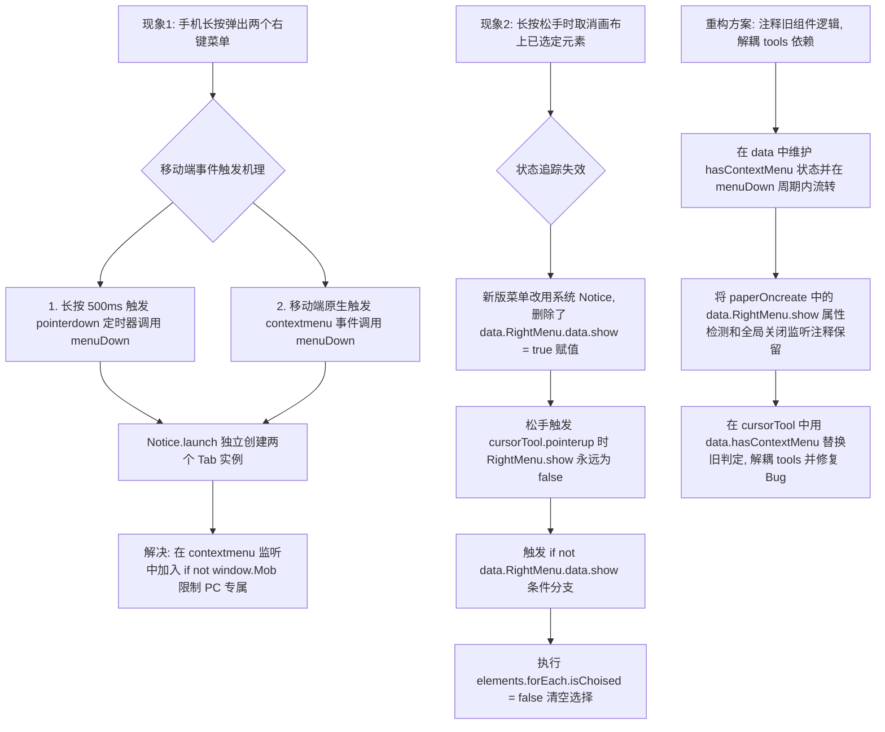
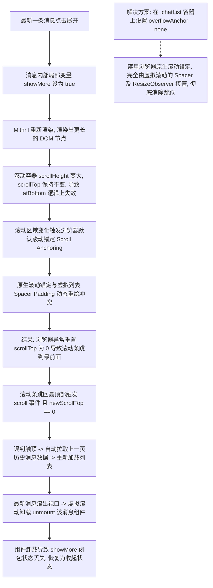
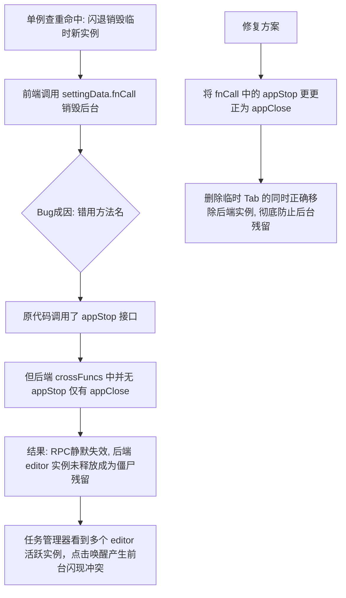
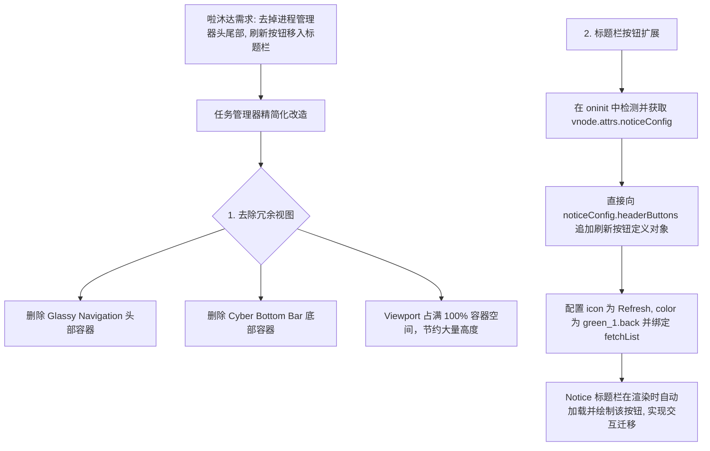
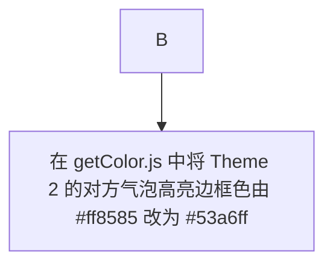
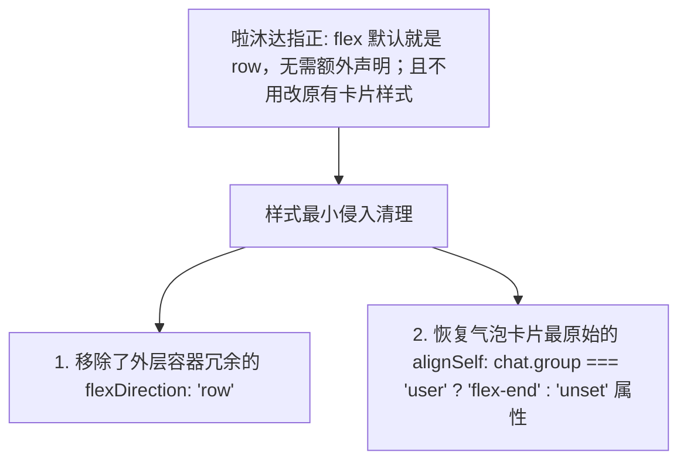

# 调查网点图记录

## 2026/07/25: 
## 2026/07/24 04:50 - 为什么属性面板中纯填充(pureFill)的X/Y坐标无法输入数字？

```mermaid
graph TD
    A[现象: 选中 pureFill 时, X/Y 文本框按键盘数字没反应/输不进去] --> B{核心机制: Mithril 单向受控组件与同步状态刷写}
    B --> C[用户敲击按键 -> 触发 oninput 并获取 e.target.value]
    C --> D[执行 element.translate 和 element.update]
    D --> E[element.update 冒泡触发 FillGroup.update]
    E --> F[recreateElements 用未发生位移的原始线条克隆覆盖 PureFill]
    F --> G[结果: PureFill 内部克隆线条坐标回滚为原状]
    G --> H[虚拟 DOM 重绘: curX 重新算出仍为旧坐标值]
    H --> I[框架检测真实 DOM 值与虚拟 DOM 值不一致 -> 同步强制刷回原值]
    I -.-> J(结论1: 键盘输入的数值被瞬间复原, 产生输入不进去的现象)
    
    K[对比: 拖拽工具 cursorTool 能否平移 pureFill?] --> L[拖拽期间只 translate 不 update]
    L --> M[拖拽结束 pointerup 时执行 fillGroup.break 解散填充组]
    M -.-> N(结论2: 拖拽由于解散了填充组, 从而切断了回滚链条并保留了坐标)
    
    J & N --> O[解决方案: 在 propPanel 的 oninput 里平移 pureFill 前主动 break 解散填充组]
```

## 2026/07/24 05:08 - 新增滴管与橡皮擦工具的命中判定与限制

```mermaid
graph TD
    A[需求: 新增滴管工具与橡皮擦工具] --> B{命中判定约束: 完全参考 cursor 事件}
    B --> C[使用 getClosedLine 寻找接触线段]
    B --> D[使用 isPointInRegion 寻找点中填充区]
    B --> E[使用 getBoundingBox 判定文本碰撞]
    
    C & D & E --> F{隔离与冒泡限制}
    F --> G[滴管: 抛弃矢量几何碰撞检测, 改用原生 EyeDropper API]
    G --> H[像素级吸色: 获得 sRGBHex 直接调用 setRecentUseColor, 不覆盖 fg/bgColor]
    
    F --> I[橡皮擦限制: 只能编辑当前组的非组元素且不能删除组]
    I --> J[过滤: parentGroup == data.presentGroup 且 type != group]
    J --> K[删除方式: 仅对符合过滤的图元执行 data.elPaper.removeAndClear]
```

## 2026/07/20 17:40 - 为什么只有 TouchEvent 能让你在嵌套中写出缩放算法？

```mermaid
graph TD
    A[核心事实修正: gameEditor 确实在嵌套里写了双指 Pinch-Zoom 缩放算法!] --> B{目标: 解释为什么同样的嵌套缩放，在那边能跑通，在这边写不出来}
    
    B --> C[你那边的核心武器: TouchEvent API 的降维打击]
    C --> D[你在 rightOncreate.coffee 第 72 行用嵌套写出了 Math.sqrt]
    D --> E[关键在于: TouchEvent 的事件对象里，自带了 e.touches 数组]
    E --> F[当你触发任何一个 touchmove 时，浏览器会把当前屏幕上**所有的**手指坐标打包在这个数组里全交给你]
    F --> G[哪怕你处于一个为手指 A 注册的局部闭包里，只要 e.touches.length==2]
    G --> H[你可以瞬间摸到 e.touches[0] 和 e.touches[1]，算完距离万事大吉]
    H -.-> I(结论1: 你的嵌套能写缩放，全拜 e.touches 这个原生的'共享数据池'所赐)
    
    B --> J[当前 svgEditor 的困境: PointerEvent API 的相互隔离]
    J --> K[PointerEvent 规范要求：每根手指都是一个独立的指针实体]
    K --> L[这意味着每次触发 pointermove，事件对象 e 里面只有**这某一根手指**的数据]
    L --> M[如果你继续用嵌套，手指 A 拿不到手指 B 的数据，就像两个人在不同的房间打电话却不知道对方号码]
    M --> N[所以，要算距离，必须在外面手动搭建一个 activePointersMap (电话薄)]
## 2020/07/20 17:40 - 为什么只有 TouchEvent 能让你在嵌套中写出缩放算法？
... (unchanged content)

## 2026/07/25 - SVG解析器补全线(closingLine)内存引用泄漏与二次平移变形

```mermaid
graph TD
    A[SVG 导入 polyline 带 fill 属性] --> B[svgParser 解析生成线段组 generatedLines]
    B --> C[判断 disSq > 0.0001 触发补全线 closingLine 逻辑]
    C --> D[原代码: points: [endPt, startPt]]
    D --> E[致命缺陷: 直接将 firstLine.s 与 lastLine.e 的内存对象指针赋值给 closingLine]
    
    E --> F[组平移 Group.translate 遍历所有子元素]
    F --> G[1. 平移 firstLine -> firstLine.s 坐标 + deltaX (移动 1x)]
    F --> H[2. 平移 lastLine -> lastLine.e 坐标 + deltaX (移动 1x)]
    F --> I[3. 平移 closingLine -> 因 points 共享内存引用, firstLine.s 与 lastLine.e 被再次加 deltaX (移动 2x!)]
    
    I --> J[结果: 共享端点被平移 2x 速度, 独享端点平移 1x 速度]
    J --> K[现象: 平移组时 3 条线长度随位移伸缩变形, 只有 1 条无共享端点的线正常]
    
    K --> L[修复方案: 深拷贝坐标 points: [{x: endPt.x, y: endPt.y}, {x: startPt.x, y: startPt.y}]]
    L --> M[解耦点对象内存引用 -> 所有人平移 1x 速度 -> 彻底恢复正常平移]
```

## 2026/07/26 - svgEditor 撤销重做架构的伪增量与纯补丁重构

```mermaid
graph TD
    A[历史记录需求: 节约撤销重做内存占用] --> B{前 AI 的废案设计 (缝合怪)}
    B --> C[使用 jsonpatch.compare 计算出 forward 和 reverse 补丁]
    B --> D[但又保留了对 elPaper 全量元素的 SvgSerializer.serializeElements]
    B --> E[最终在 historyDatas 中同时存入补丁与 10MB 的全量 snapshot]
    E -.-> F(结果: 假增量真冗余! 计算了补丁却没节约内存, 依然引发 V8 GC 压力)

    A --> G{我的纯血增量设计 (Pure Patch)}
    G --> H[record 拦截: 若 forward.length == 0, 极简防抖丢弃无效记录]
    G --> I[内存维护唯一一份 @lastSnapshot]
    G --> J[入栈: 坚决丢弃 snapshot, 仅推入 forward 与 reverse 补丁]
    
    J --> K[撤销重做]
    K --> L[对 @lastSnapshot 执行 jsonpatch.applyPatch]
    L --> M[反序列化后替换当前画布并重绘]
    
    J --> N[历史面板任意跳转]
    N --> O[废弃直接读取全量的 O(1) 蠢笨逻辑]
    N --> P[以当前 @lastSnapshot 状态为锚点, 沿着差分补丁链步进推演]
    P --> Q[在微秒内算出目标历史时刻全量, 实现 99% 的内存释放!]
```

## 2026/07/27 21:36 - 右键 Notice 菜单引起的松手取消选中与双菜单 Bug 溯源

```mermaid
graph TD
    A[现象1: 手机长按弹出两个右键菜单] --> B{移动端事件触发机理}
    B --> C[1. 长按 500ms 触发 pointerdown 定时器调用 menuDown]
    B --> D[2. 移动端原生触发 contextmenu 事件调用 menuDown]
    C & D --> E[Notice.launch 独立创建两个 Tab 实例]
    E --> F[解决: 在 contextmenu 监听中加入 if not window.Mob 限制 PC 专属]

    G[现象2: 长按松手时取消画布上已选定元素] --> H{状态追踪失效}
    H --> I[新版菜单改用系统 Notice, 删除了 data.RightMenu.data.show = true 赋值]
    I --> J[松手触发 cursorTool.pointerup 时 RightMenu.show 永远为 false]
    J --> K[触发 if not data.RightMenu.data.show 条件分支]
    K --> L[执行 elements.forEach.isChoised = false 清空选择]
    
    M[重构方案: 注释旧组件逻辑, 解耦 tools 依赖]
    M --> N[在 data 中维护 hasContextMenu 状态并在 menuDown 周期内流转]
    N --> O[将 paperOncreate 中的 data.RightMenu.show 属性检测和全局关闭监听注释保留]
    O --> P[在 cursorTool 中用 data.hasContextMenu 替换旧判定, 解耦 tools 并修复 Bug]
```

## 2026/08/07 07:46 - 消息列表最新一条消息展开导致滚动条跳跃且无法展开

```mermaid
graph TD
    A[最新一条消息点击展开] --> B[消息内部局部变量 showMore 设为 true]
    B --> C[Mithril 重新渲染, 渲染出更长的 DOM 节点]
    C --> D[滚动容器 scrollHeight 变大, scrollTop 保持不变, 导致 atBottom 逻辑上失效]
    D --> E[滚动区域变化触发浏览器默认滚动锚定 Scroll Anchoring]
    E --> F[原生滚动锚定与虚拟列表 Spacer Padding 动态重绘冲突]
    F --> G[结果: 浏览器异常重置 scrollTop 为 0 导致滚动条跳到最前面]
    G --> H[滚动条跳回最顶部触发 scroll 事件 且 newScrollTop == 0]
    H --> I[误判触顶 -> 自动拉取上一页历史消息数据 -> 重新加载列表]
    I --> J[最新消息滚出视口 -> 虚拟滚动卸载 unmount 该消息组件]
    J --> K[组件卸载导致 showMore 闭包状态丢失, 恢复为收起状态]
    
    L[解决方案: 在 .chatList 容器上设置 overflowAnchor: none]
    L -.-> M[禁用浏览器原生滚动锚定, 完全由虚拟滚动的 Spacer 及 ResizeObserver 接管, 彻底消除跳跃]
```

## 2026/08/07 09:23 - 编辑器冲突拦截、右键批注与 Diff 悬浮跳转导航系统

```mermaid
graph TD
    A[编辑器保存文件] --> B{检测机制: mtimeMs 对比}
    B -->|一致| C[直接保存写入]
    B -->|不一致| D[拦截并弹出 ConflictResolveComponent 弹窗]
    D --> E[1. 强行覆盖: 带 force=true 重新写入]
    D --> F[2. 重新加载: open 动作重新拉取磁盘内容]
    D --> G[3. 对比差异: 调起 isConflictDiff 模式进行 Monaco Diff 比对]
    
    H[进入 Diff 比对模式] --> I{是否计算出差异列表?}
    I -->|是| J[onDidUpdateDiff: 自动 revealLineInCenter 定位至首处差异]
    I -->|是| K[右下角悬浮展示磨砂导航胶囊: 差异 x / y]
    K --> L[点击 ◀ / ▶ 按钮: 平滑跳转至对应差异位置]
    
    M[Monaco ModifiedEditor 右键菜单] --> N[添加行批注 -> Notice 原生 confirm 录入]
    N --> O[底部小标签横向管理 -> 批准或拒绝时追加进 comment 回传给 AI]

## 2026/08/07 14:56 - 重载提示窗口被激活窗口遮挡Bug修复

```mermaid
graph TD
    A[单例命中: 检测到文件已被外部修改并且旧窗口为 isDirty] --> B[调用 appActive 激活/置顶旧窗口]
    B --> C{Bug成因: 异步 IPC 激活时序滞后}
    C --> D[appActive 在后台异步广播 app:active 事件]
    C --> E[同时 Notice.launch 同步并立即弹出 ask_reload 提示框]
    D --> F[前端稍后收到 app:active 触发 activateWindow 置顶编辑器]
    F --> G[编辑器窗口置顶 -> 刚好将刚刚弹出的 ask_reload 提示框盖住]
    
    H[修复方案: 异步流程链式与延迟控制] --> I[将后续检测 and Notice.launch 移入 appActive.then 回调]
    I --> J[在弹窗判定前加入 await sleep 100ms]
    J --> K[确保原窗口的 activateWindow 已经彻底执行完毕并置顶]
    K --> L[最后执行 Notice.launch -> 询问弹窗必定在最上层展示, 解决遮挡问题]
```

## 2026/08/07 15:00 - 查重单例销毁后台实例残留Bug修复

```mermaid
graph TD
    A[单例查重命中: 闪退销毁临时新实例] --> B[前端调用 settingData.fnCall 销毁后台]
    B --> C{Bug成因: 错用方法名}
    C --> D[原代码调用了 appStop 接口]
    D --> E[但后端 crossFuncs 中并无 appStop 仅有 appClose]
    E --> F[结果: RPC静默失效, 后端 editor 实例未释放成为僵尸残留]
    F --> G[任务管理器看到多个 editor 活跃实例，点击唤醒产生前台闪现冲突]
    
    H[修复方案] --> I[将 fnCall 中的 appStop 更更正为 appClose]
    I --> J[删除临时 Tab 的同时正确移除后端实例, 彻底防止后台残留]
```

## 2026/08/07 15:06 - 任务管理器响应式重构与主题配色规范化

```mermaid
graph TD
    A[需求: 重构任务管理器 UI 以适配拉伸后的移动端界面] --> B[应用样式与配色规范设计]
    
    B --> C{1. 响应式布局设计}
    C --> D[引入 ResizeObserver 侦听容器 DOM 宽度]
    D --> E[定义 isMob = containerWidth < 500px 阈值]
    E --> F[isMob=false: 保持原本的水平行排列布局]
    E --> G[isMob=true: 切换为垂直列排列布局, 控制按钮堆叠在右下方防止文本重合]
    
    B --> H{2. 配色规范化}
    H --> I[剔除 StatusBadge 和 Toolset 上的 #23D4B2 和 #F06258 等硬编码色值]
    I --> J[接入全局 getColor 机制, 绑定 green_1, pink_1, yellow_1 等主题色]
    J --> K[确保卡片状态与按键能够随系统主题切换完美自动配色]
    
    B --> L{3. 样式细节微调}
    L --> M[将原先的所有 px 单位转换为符合系统规范 the rem 单位]
    L --> N[使用 m('', ...) 缩写代替原先的 m('div', ...) 进行节点渲染]
```

## 2026/08/07 15:08 - 任务管理器头尾部精简与刷新按钮移至标题栏

```mermaid
graph TD
    A[啦沐达需求: 去掉进程管理器头尾部, 刷新按钮移入标题栏] --> B[任务管理器精简化改造]
    
    B --> C{1. 去除冗余视图}
    C --> D[删除 Glassy Navigation 头部容器]
    C --> E[删除 Cyber Bottom Bar 底部容器]
    C --> F[Viewport 占满 100% 容器空间，节约大量高度]
    
    H[2. 标题栏按钮扩展] --> I[在 oninit 中检测并获取 vnode.attrs.noticeConfig]
    I --> J[直接向 noticeConfig.headerButtons 追加刷新按钮定义对象]
    J --> K[配置 icon 为 Refresh, color 为 green_1.back 并绑定 fetchList]
    K --> L[Notice 标题栏在渲染时自动加载并绘制该按钮, 实现交互迁移]
```

## 2026/08/07 15:11 - 引入系统 Box 与 Tag 组件规范化布局

```mermaid
graph TD
    A[啦沐达指正: 没有使用 Box 和 Tag 组件且添加了额外样式导致边距不对] --> B[遵循开发规范重构]
    
    B --> C{1. 移除多余包裹与背景覆盖}
    C --> D[移除最外层 view() 自带的 background, width, height, overflow 属性]
    D --> E[彻底消除对 Notice 宿主容器 .window-box 的样式冲突]
    E --> F[使 Viewport 只通过 flex: 1 撑开并在 viewport 内滚动, 消除双重边距]
    
    B --> G{2. 使用 Box 重构卡片}
    G --> H[卡片 AppCard 改为 m(Box, { color: 'gray_3', isBlock: true }) 渲染]
    H --> I[删除手写的 padding, borderRadius, border 等额外覆盖样式]
    I --> J[完全继承系统 Box 组件自带的边距、圆角与阴影规范]
    
    B --> K{3. 使用 Tag 重构状态与控制键}
    K --> L[StatusBadge 状态胶囊改由 m(Tag, { color: badgeColor }) 渲染]
    L --> M[控制按钮 (唤醒/引用/杀死) 改由 m(Tag, { isBtn: true, color: '...' }) 渲染]
    M --> N[利用 Tag 的紧凑边距排版 icon, 移除额外手写的 width/height 与背景]
```

## 2026/08/07 15:12 - 进程管理器应用图标真实 SVG 渲染

```mermaid
graph TD
    A[问题: 任务管理器里的 App 图标显示为固定的首字母占位, 无法正常加载图标] --> B[接入真实图标资源接口]
    
    B --> C[1. 识别接口路由]
    C --> D[后端 getSummary() 已返回 icon 属性 (如 icon.svg)]
    D --> E[静态资源真实路由为 /api/apps/{type}/{icon}]
    
    B --> F[2. 重构图标渲染]
    F --> G[在 AppCard 的头像框内渲染 m('img', { src: iconUrl })]
    G --> H[加入 onerror 监听: 若加载失败, 自动降级渲染大写首字母作为安全兜底]
```

## 2026/08/07 15:13 - 消除应用图标双重边框与内边距样式修补

```mermaid
graph TD
    A[啦沐达指正: 应用图标外层仍有冗余的渐变背景与内边距, 导致双重边框] --> B[应用样式精简化适配]
    
    B --> C[1. 移除了 icon 容器上的 background 渐变与 padding: 0.4rem]
    C --> D[2. 真实的 SVG 图像得以铺满 rounded-square 容器的边缘 (Bleed-to-edge)]
    D --> E[3. 依靠容器自身的 overflow: hidden 切出美观的 rounded-square 图标]
    
    F --> G[在 onerror 中, 加载失败时动态将 background 渐变与 text 颜色写回容器]
    G --> H[使降级首字母头像依然拥有精美底色, 完美自适应两种状态]
```

## 2026/08/07 15:23 - 统一聊天气泡与工具组卡片为 50% 透明度

```mermaid
graph TD
    A[啦沐达指正: 气泡透明度不满意, 且用户/AI与工具组透明度不一致] --> B[气泡背景透明度重置]
    
    B --> C{1. 聊天卡片 (ChatItem.js)}
    C --> D[用户气泡 background 的十六进制透明度后缀由 ee (93%) 改为 80 (50%)]
    C --> E[AI 气泡 background 的十六进制透明度后缀由 ee (93%) 改为 80 (50%)]
    C --> F[思考中气泡与工具组消息气泡加入 80 (50%) 透明度后缀]
    
    G --> H[实现工具组卡片 50% 透明度，隐约呈现底部人物线稿]
```

## 2026/08/07 15:28 - 引入中文平铺字符串气泡配色项便于配置

```mermaid
graph TD
    A[啦沐达需求: 方便修改配色, 引入中文命名配色项且为纯色值] --> B[主题配色扩展]
    
    B --> C{1. 新增颜色项 (colorObj.js & getColor.js)}
    C --> D[我方气泡背景色 / 我方气泡高亮边框色]
    C --> E[对方气泡背景色 / 对方气泡高亮边框色]
    C --> F[思考中气泡背景色 / 思考中气泡高亮边框色]
    
    G --> H[移去原 .back 属性调用, 改为将 getColor 字符串直接拼接 '+ 80']
    H --> I[实现气泡样式与系统底层主题的解耦, 彻底方便啦沐达日常修改配色]
```

## 2026/08/07 15:32 - 蓝色主题下对方高亮边框色改为蓝色主色调

```mermaid
graph TD
    B --> C[在 getColor.js 中将 Theme 2 的对方气泡高亮边框色由 #ff8585 改为 #53a6ff]
```

## 2026/08/07 15:35 - 气泡侧边引入圆形头像框展示

```mermaid
graph TD
    A[啦沐达需求: 我方和对方的气泡加头像框, 我方用圆代替, 对方根据 playFace 渲染背景图] --> B[气泡层级重构]
    
    B --> C[1. 引入行布局包装器]
    C --> D[将原气泡容器最外层改为 display: flex, flexDirection: row 容器]
    D --> E[我方气泡设置 alignSelf: flex-end, 对方设置 alignSelf: flex-start]
    
    B --> F[2. 头像框圆形渲染 (圆形 div)]
    F --> G[我方头像: 使用 backgroundColor 填充为我方高亮色]
    F --> H[对方头像: 使用 backgroundImage 指向表情 PNG 资源, 并配合 backgroundSize/Position 居中缩放]
```

## 2026/08/07 15:40 - 修复头像嵌套 Row 容器导致的编译错误

```mermaid
graph TD
    A[编译错误: 缺少关闭括号与多余花括号] --> B[语法层级微调]
    B --> C[1. 补充 Row 容器底部的关闭括号 ])]
    B --> D[2. 移除多余的末尾花括号 }]
```

## 2026/08/07 15:43 - 移去冗余样式并恢复原有气泡属性

```mermaid
graph TD
    A[啦沐达指正: flex 默认就是 row，无需额外声明；且不用改原有卡片样式] --> B[样式最小侵入清理]
    B --> C[1. 移除了外层容器冗余的 flexDirection: 'row']
    B --> D[2. 恢复气泡卡片最原始的 alignSelf: chat.group === 'user' ? 'flex-end' : 'unset' 属性]
```

