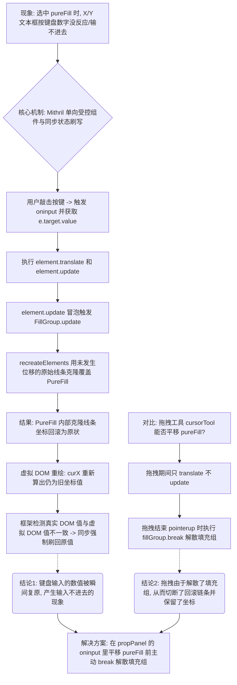
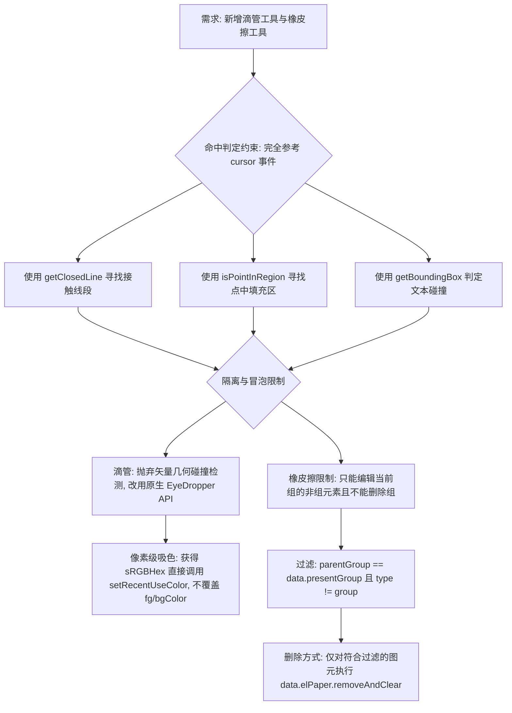
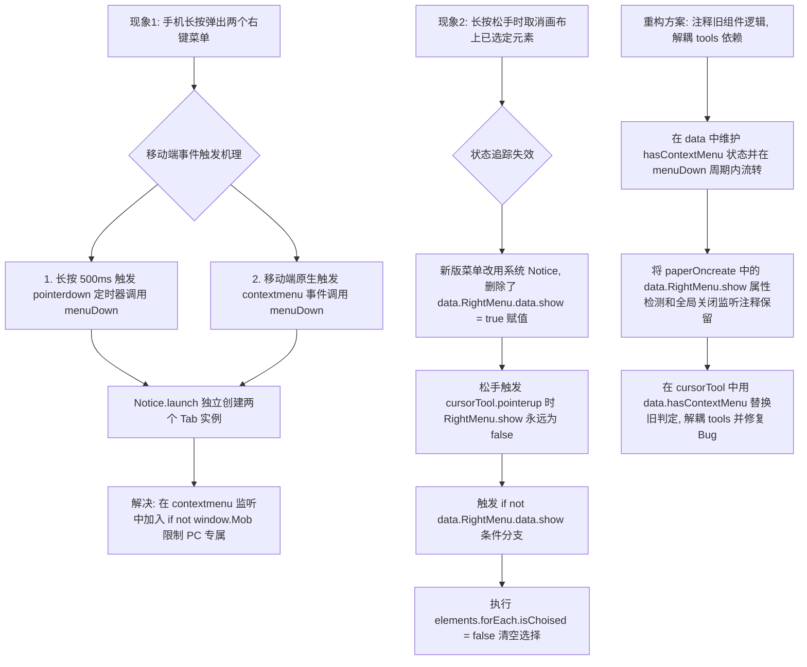
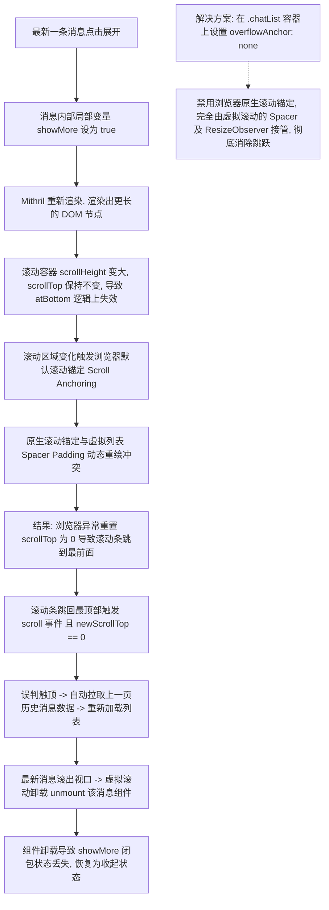
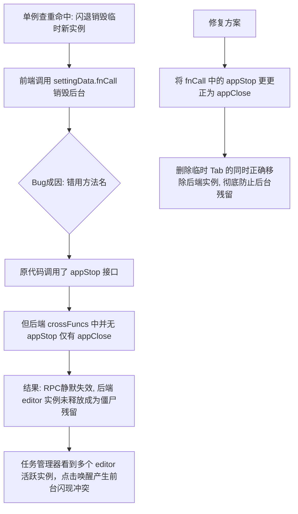
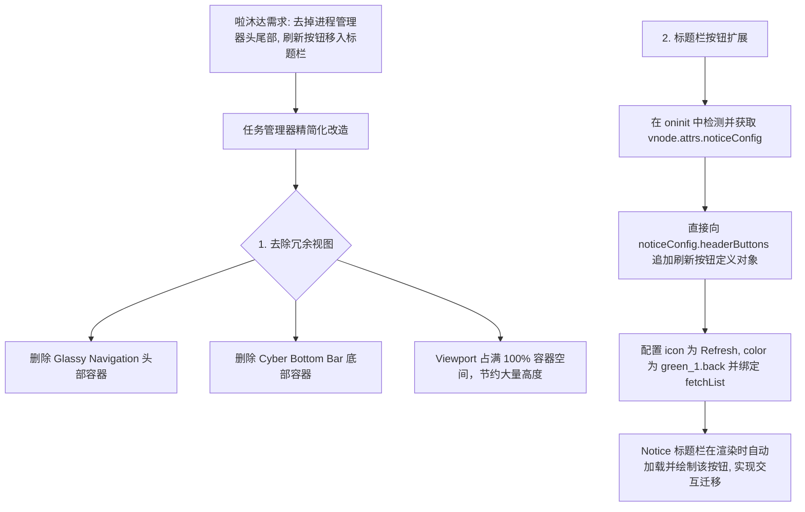
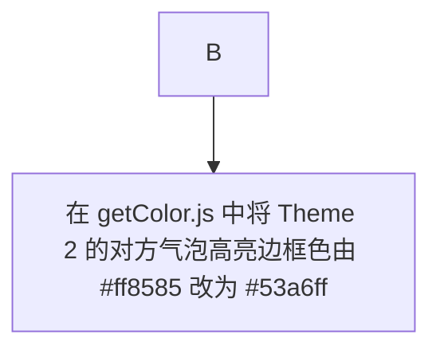
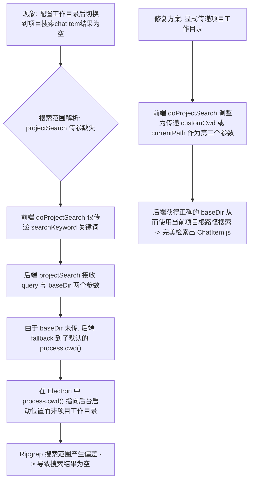

# 调查网点图记录

## 2026/07/25: 
## 2026/07/24 04:50 - 为什么属性面板中纯填充(pureFill)的X/Y坐标无法输入数字？

```mermaid
graph TD
    A[现象: 选中 pureFill 时, X/Y 文本框按键盘数字没反应/输不进去] --> B{核心机制: Mithril 单向受控组件与同步状态刷写}
    B --> C[用户敲击按键 -> 触发 oninput 并获取 e.target.value]
    C --> D[执行 element.translate 和 element.update]
    D --> E[element.update 冒泡触发 FillGroup.update]
    E --> F[recreateElements 用未发生位移的原始线条克隆覆盖 PureFill]
    F --> G[结果: PureFill 内部克隆线条坐标回滚为原状]
    G --> H[虚拟 DOM 重绘: curX 重新算出仍为旧坐标值]
    H --> I[框架检测真实 DOM 值与虚拟 DOM 值不一致 -> 同步强制刷回原值]
    I -.-> J(结论1: 键盘输入的数值被瞬间复原, 产生输入不进去的现象)
    
    K[对比: 拖拽工具 cursorTool 能否平移 pureFill?] --> L[拖拽期间只 translate 不 update]
    L --> M[拖拽结束 pointerup 时执行 fillGroup.break 解散填充组]
    M -.-> N(结论2: 拖拽由于解散了填充组, 从而切断了回滚链条并保留了坐标)
    
    J & N --> O[解决方案: 在 propPanel 的 oninput 里平移 pureFill 前主动 break 解散填充组]
```

## 2026/07/24 05:08 - 新增滴管与橡皮擦工具的命中判定与限制

```mermaid
graph TD
    A[需求: 新增滴管工具与橡皮擦工具] --> B{命中判定约束: 完全参考 cursor 事件}
    B --> C[使用 getClosedLine 寻找接触线段]
    B --> D[使用 isPointInRegion 寻找点中填充区]
    B --> E[使用 getBoundingBox 判定文本碰撞]
    
    C & D & E --> F{隔离与冒泡限制}
    F --> G[滴管: 抛弃矢量几何碰撞检测, 改用原生 EyeDropper API]
    G --> H[像素级吸色: 获得 sRGBHex 直接调用 setRecentUseColor, 不覆盖 fg/bgColor]
    
    F --> I[橡皮擦限制: 只能编辑当前组的非组元素且不能删除组]
    I --> J[过滤: parentGroup == data.presentGroup 且 type != group]
    J --> K[删除方式: 仅对符合过滤的图元执行 data.elPaper.removeAndClear]
```

## 2026/07/20 17:40 - 为什么只有 TouchEvent 能让你在嵌套中写出缩放算法？

```mermaid
graph TD
    A[核心事实修正: gameEditor 确实在嵌套里写了双指 Pinch-Zoom 缩放算法!] --> B{目标: 解释为什么同样的嵌套缩放，在那边能跑通，在这边写不出来}
    
    B --> C[你那边的核心武器: TouchEvent API 的降维打击]
    C --> D[你在 rightOncreate.coffee 第 72 行用嵌套写出了 Math.sqrt]
    D --> E[关键在于: TouchEvent 的事件对象里，自带了 e.touches 数组]
    E --> F[当你触发任何一个 touchmove 时，浏览器会把当前屏幕上**所有的**手指坐标打包在这个数组里全交给你]
    F --> G[哪怕你处于一个为手指 A 注册的局部闭包里，只要 e.touches.length==2]
    G --> H[你可以瞬间摸到 e.touches[0] 和 e.touches[1]，算完距离万事大吉]
    H -.-> I(结论1: 你的嵌套能写缩放，全拜 e.touches 这个原生的'共享数据池'所赐)
    
    B --> J[当前 svgEditor 的困境: PointerEvent API 的相互隔离]
    J --> K[PointerEvent 规范要求：每根手指都是一个独立的指针实体]
    K --> L[这意味着每次触发 pointermove，事件对象 e 里面只有**这某一根手指**的数据]
    L --> M[如果你继续用嵌套，手指 A 拿不到手指 B 的数据，就像两个人在不同的房间打电话却不知道对方号码]
    M --> N[所以，要算距离，必须在外面手动搭建一个 activePointersMap (电话薄)]
## 2020/07/20 17:40 - 为什么只有 TouchEvent 能让你在嵌套中写出缩放算法？
... (unchanged content)

## 2026/07/25 - SVG解析器补全线(closingLine)内存引用泄漏与二次平移变形

```mermaid
graph TD
    A[SVG 导入 polyline 带 fill 属性] --> B[svgParser 解析生成线段组 generatedLines]
    B --> C[判断 disSq > 0.0001 触发补全线 closingLine 逻辑]
    C --> D[原代码: points: [endPt, startPt]]
    D --> E[致命缺陷: 直接将 firstLine.s 与 lastLine.e 的内存对象指针赋值给 closingLine]
    
    E --> F[组平移 Group.translate 遍历所有子元素]
    F --> G[1. 平移 firstLine -> firstLine.s 坐标 + deltaX (移动 1x)]
    F --> H[2. 平移 lastLine -> lastLine.e 坐标 + deltaX (移动 1x)]
    F --> I[3. 平移 closingLine -> 因 points 共享内存引用, firstLine.s 与 lastLine.e 被再次加 deltaX (移动 2x!)]
    
    I --> J[结果: 共享端点被平移 2x 速度, 独享端点平移 1x 速度]
    J --> K[现象: 平移组时 3 条线长度随位移伸缩变形, 只有 1 条无共享端点的线正常]
    
    K --> L[修复方案: 深拷贝坐标 points: [{x: endPt.x, y: endPt.y}, {x: startPt.x, y: startPt.y}]]
    L --> M[解耦点对象内存引用 -> 所有人平移 1x 速度 -> 彻底恢复正常平移]
```

## 2026/07/26 - svgEditor 撤销重做架构的伪增量与纯补丁重构

```mermaid
graph TD
    A[历史记录需求: 节约撤销重做内存占用] --> B{前 AI 的废案设计 (缝合怪)}
    B --> C[使用 jsonpatch.compare 计算出 forward 和 reverse 补丁]
    B --> D[但又保留了对 elPaper 全量元素的 SvgSerializer.serializeElements]
    B --> E[最终在 historyDatas 中同时存入补丁与 10MB 的全量 snapshot]
    E -.-> F(结果: 假增量真冗余! 计算了补丁却没节约内存, 依然引发 V8 GC 压力)

    A --> G{我的纯血增量设计 (Pure Patch)}
    G --> H[record 拦截: 若 forward.length == 0, 极简防抖丢弃无效记录]
    G --> I[内存维护唯一一份 @lastSnapshot]
    G --> J[入栈: 坚决丢弃 snapshot, 仅推入 forward 与 reverse 补丁]
    
    J --> K[撤销重做]
    K --> L[对 @lastSnapshot 执行 jsonpatch.applyPatch]
    L --> M[反序列化后替换当前画布并重绘]
    
    J --> N[历史面板任意跳转]
    N --> O[废弃直接读取全量的 O(1) 蠢笨逻辑]
    N --> P[以当前 @lastSnapshot 状态为锚点, 沿着差分补丁链步进推演]
    P --> Q[在微秒内算出目标历史时刻全量, 实现 99% 的内存释放!]
```

## 2026/07/27 21:36 - 右键 Notice 菜单引起的松手取消选中与双菜单 Bug 溯源

```mermaid
graph TD
    A[现象1: 手机长按弹出两个右键菜单] --> B{移动端事件触发机理}
    B --> C[1. 长按 500ms 触发 pointerdown 定时器调用 menuDown]
    B --> D[2. 移动端原生触发 contextmenu 事件调用 menuDown]
    C & D --> E[Notice.launch 独立创建两个 Tab 实例]
    E --> F[解决: 在 contextmenu 监听中加入 if not window.Mob 限制 PC 专属]

    G[现象2: 长按松手时取消画布上已选定元素] --> H{状态追踪失效}
    H --> I[新版菜单改用系统 Notice, 删除了 data.RightMenu.data.show = true 赋值]
    I --> J[松手触发 cursorTool.pointerup 时 RightMenu.show 永远为 false]
    J --> K[触发 if not data.RightMenu.data.show 条件分支]
    K --> L[执行 elements.forEach.isChoised = false 清空选择]
    
    M[重构方案: 注释旧组件逻辑, 解耦 tools 依赖]
    M --> N[在 data 中维护 hasContextMenu 状态并在 menuDown 周期内流转]
    N --> O[将 paperOncreate 中的 data.RightMenu.show 属性检测和全局关闭监听注释保留]
    O --> P[在 cursorTool 中用 data.hasContextMenu 替换旧判定, 解耦 tools 并修复 Bug]
```

## 2026/08/07 07:46 - 消息列表最新一条消息展开导致滚动条跳跃且无法展开

```mermaid
graph TD
    A[最新一条消息点击展开] --> B[消息内部局部变量 showMore 设为 true]
    B --> C[Mithril 重新渲染, 渲染出更长的 DOM 节点]
    C --> D[滚动容器 scrollHeight 变大, scrollTop 保持不变, 导致 atBottom 逻辑上失效]
    D --> E[滚动区域变化触发浏览器默认滚动锚定 Scroll Anchoring]
    E --> F[原生滚动锚定与虚拟列表 Spacer Padding 动态重绘冲突]
    F --> G[结果: 浏览器异常重置 scrollTop 为 0 导致滚动条跳到最前面]
    G --> H[滚动条跳回最顶部触发 scroll 事件 且 newScrollTop == 0]
    H --> I[误判触顶 -> 自动拉取上一页历史消息数据 -> 重新加载列表]
    I --> J[最新消息滚出视口 -> 虚拟滚动卸载 unmount 该消息组件]
    J --> K[组件卸载导致 showMore 闭包状态丢失, 恢复为收起状态]
    
    L[解决方案: 在 .chatList 容器上设置 overflowAnchor: none]
    L -.-> M[禁用浏览器原生滚动锚定, 完全由虚拟滚动的 Spacer 及 ResizeObserver 接管, 彻底消除跳跃]
```

## 2026/08/07 09:23 - 编辑器冲突拦截、右键批注与 Diff 悬浮跳转导航系统

```mermaid
graph TD
    A[编辑器保存文件] --> B{检测机制: mtimeMs 对比}
    B -->|一致| C[直接保存写入]
    B -->|不一致| D[拦截并弹出 ConflictResolveComponent 弹窗]
    D --> E[1. 强行覆盖: 带 force=true 重新写入]
    D --> F[2. 重新加载: open 动作重新拉取磁盘内容]
    D --> G[3. 对比差异: 调起 isConflictDiff 模式进行 Monaco Diff 比对]
    
    H[进入 Diff 比对模式] --> I{是否计算出差异列表?}
    I -->|是| J[onDidUpdateDiff: 自动 revealLineInCenter 定位至首处差异]
    I -->|是| K[右下角悬浮展示磨砂导航胶囊: 差异 x / y]
    K --> L[点击 ◀ / ▶ 按钮: 平滑跳转至对应差异位置]
    
    M[Monaco ModifiedEditor 右键菜单] --> N[添加行批注 -> Notice 原生 confirm 录入]
    N --> O[底部小标签横向管理 -> 批准或拒绝时追加进 comment 回传给 AI]

## 2026/08/07 14:56 - 重载提示窗口被激活窗口遮挡Bug修复

```mermaid
graph TD
    A[单例命中: 检测到文件已被外部修改并且旧窗口为 isDirty] --> B[调用 appActive 激活/置顶旧窗口]
    B --> C{Bug成因: 异步 IPC 激活时序滞后}
    C --> D[appActive 在后台异步广播 app:active 事件]
    C --> E[同时 Notice.launch 同步并立即弹出 ask_reload 提示框]
    D --> F[前端稍后收到 app:active 触发 activateWindow 置顶编辑器]
    F --> G[编辑器窗口置顶 -> 刚好将刚刚弹出的 ask_reload 提示框盖住]
    
    H[修复方案: 异步流程链式与延迟控制] --> I[将后续检测 and Notice.launch 移入 appActive.then 回调]
    I --> J[在弹窗判定前加入 await sleep 100ms]
    J --> K[确保原窗口的 activateWindow 已经彻底执行完毕并置顶]
    K --> L[最后执行 Notice.launch -> 询问弹窗必定在最上层展示, 解决遮挡问题]
```

## 2026/08/07 15:00 - 查重单例销毁后台实例残留Bug修复

```mermaid
graph TD
    A[单例查重命中: 闪退销毁临时新实例] --> B[前端调用 settingData.fnCall 销毁后台]
    B --> C{Bug成因: 错用方法名}
    C --> D[原代码调用了 appStop 接口]
    D --> E[但后端 crossFuncs 中并无 appStop 仅有 appClose]
    E --> F[结果: RPC静默失效, 后端 editor 实例未释放成为僵尸残留]
    F --> G[任务管理器看到多个 editor 活跃实例，点击唤醒产生前台闪现冲突]
    
    H[修复方案] --> I[将 fnCall 中的 appStop 更更正为 appClose]
    I --> J[删除临时 Tab 的同时正确移除后端实例, 彻底防止后台残留]
```

## 2026/08/07 15:06 - 任务管理器响应式重构与主题配色规范化

```mermaid
graph TD
    A[需求: 重构任务管理器 UI 以适配拉伸后的移动端界面] --> B[应用样式与配色规范设计]
    
    B --> C{1. 响应式布局设计}
    C --> D[引入 ResizeObserver 侦听容器 DOM 宽度]
    D --> E[定义 isMob = containerWidth < 500px 阈值]
    E --> F[isMob=false: 保持原本的水平行排列布局]
    E --> G[isMob=true: 切换为垂直列排列布局, 控制按钮堆叠在右下方防止文本重合]
    
    B --> H{2. 配色规范化}
    H --> I[剔除 StatusBadge 和 Toolset 上的 #23D4B2 和 #F06258 等硬编码色值]
    I --> J[接入全局 getColor 机制, 绑定 green_1, pink_1, yellow_1 等主题色]
    J --> K[确保卡片状态与按键能够随系统主题切换完美自动配色]
    
    B --> L{3. 样式细节微调}
    L --> M[将原先的所有 px 单位转换为符合系统规范 the rem 单位]
    L --> N[使用 m('', ...) 缩写代替原先的 m('div', ...) 进行节点渲染]
```

## 2026/08/07 15:08 - 任务管理器头尾部精简与刷新按钮移至标题栏

```mermaid
graph TD
    A[啦沐达需求: 去掉进程管理器头尾部, 刷新按钮移入标题栏] --> B[任务管理器精简化改造]
    
    B --> C{1. 去除冗余视图}
    C --> D[删除 Glassy Navigation 头部容器]
    C --> E[删除 Cyber Bottom Bar 底部容器]
    C --> F[Viewport 占满 100% 容器空间，节约大量高度]
    
    H[2. 标题栏按钮扩展] --> I[在 oninit 中检测并获取 vnode.attrs.noticeConfig]
    I --> J[直接向 noticeConfig.headerButtons 追加刷新按钮定义对象]
    J --> K[配置 icon 为 Refresh, color 为 green_1.back 并绑定 fetchList]
    K --> L[Notice 标题栏在渲染时自动加载并绘制该按钮, 实现交互迁移]
```

## 2026/08/07 15:11 - 引入系统 Box 与 Tag 组件规范化布局

```mermaid
graph TD
    A[啦沐达指正: 没有使用 Box 和 Tag 组件且添加了额外样式导致边距不对] --> B[遵循开发规范重构]
    
    B --> C{1. 移除多余包裹与背景覆盖}
    C --> D[移除最外层 view() 自带的 background, width, height, overflow 属性]
    D --> E[彻底消除对 Notice 宿主容器 .window-box 的样式冲突]
    E --> F[使 Viewport 只通过 flex: 1 撑开并在 viewport 内滚动, 消除双重边距]
    
    B --> G{2. 使用 Box 重构卡片}
    G --> H[卡片 AppCard 改为 m(Box, { color: 'gray_3', isBlock: true }) 渲染]
    H --> I[删除手写的 padding, borderRadius, border 等额外覆盖样式]
    I --> J[完全继承系统 Box 组件自带的边距、圆角与阴影规范]
    
    B --> K{3. 使用 Tag 重构状态与控制键}
    K --> L[StatusBadge 状态胶囊改由 m(Tag, { color: badgeColor }) 渲染]
    L --> M[控制按钮 (唤醒/引用/杀死) 改由 m(Tag, { isBtn: true, color: '...' }) 渲染]
    M --> N[利用 Tag 的紧凑边距排版 icon, 移除额外手写的 width/height 与背景]
```

## 2026/08/07 15:12 - 进程管理器应用图标真实 SVG 渲染

```mermaid
graph TD
    A[问题: 任务管理器里的 App 图标显示为固定的首字母占位, 无法正常加载图标] --> B[接入真实图标资源接口]
    
    B --> C[1. 识别接口路由]
    C --> D[后端 getSummary() 已返回 icon 属性 (如 icon.svg)]
    D --> E[静态资源真实路由为 /api/apps/{type}/{icon}]
    
    B --> F[2. 重构图标渲染]
    F --> G[在 AppCard 的头像框内渲染 m('img', { src: iconUrl })]
    G --> H[加入 onerror 监听: 若加载失败, 自动降级渲染大写首字母作为安全兜底]
```

## 2026/08/07 15:13 - 消除应用图标双重边框与内边距样式修补

```mermaid
graph TD
    A[啦沐达指正: 应用图标外层仍有冗余的渐变背景与内边距, 导致双重边框] --> B[应用样式精简化适配]
    
    B --> C[1. 移除了 icon 容器上的 background 渐变与 padding: 0.4rem]
    C --> D[2. 真实的 SVG 图像得以铺满 rounded-square 容器的边缘 (Bleed-to-edge)]
    D --> E[3. 依靠容器自身的 overflow: hidden 切出美观的 rounded-square 图标]
    
    F --> G[在 onerror 中, 加载失败时动态将 background 渐变与 text 颜色写回容器]
    G --> H[使降级首字母头像依然拥有精美底色, 完美自适应两种状态]
```

## 2026/08/07 15:23 - 统一聊天气泡与工具组卡片为 50% 透明度

```mermaid
graph TD
    A[啦沐达指正: 气泡透明度不满意, 且用户/AI与工具组透明度不一致] --> B[气泡背景透明度重置]
    
    B --> C{1. 聊天卡片 (ChatItem.js)}
    C --> D[用户气泡 background 的十六进制透明度后缀由 ee (93%) 改为 80 (50%)]
    C --> E[AI 气泡 background 的十六进制透明度后缀由 ee (93%) 改为 80 (50%)]
    C --> F[思考中气泡与工具组消息气泡加入 80 (50%) 透明度后缀]
    
    G --> H[实现工具组卡片 50% 透明度，隐约呈现底部人物线稿]
```

## 2026/08/07 15:28 - 引入中文平铺字符串气泡配色项便于配置

```mermaid
graph TD
    A[啦沐达需求: 方便修改配色, 引入中文命名配色项且为纯色值] --> B[主题配色扩展]
    
    B --> C{1. 新增颜色项 (colorObj.js & getColor.js)}
    C --> D[我方气泡背景色 / 我方气泡高亮边框色]
    C --> E[对方气泡背景色 / 对方气泡高亮边框色]
    C --> F[思考中气泡背景色 / 思考中气泡高亮边框色]
    
    G --> H[移去原 .back 属性调用, 改为将 getColor 字符串直接拼接 '+ 80']
    H --> I[实现气泡样式与系统底层主题的解耦, 彻底方便啦沐达日常修改配色]
```

## 2026/08/07 15:32 - 蓝色主题下对方高亮边框色改为蓝色主色调

```mermaid
graph TD
    B --> C[在 getColor.js 中将 Theme 2 的对方气泡高亮边框色由 #ff8585 改为 #53a6ff]
```

## 2026/08/07 15:35 - 气泡侧边引入圆形头像框展示

```mermaid
graph TD
    A[啦沐达需求: 我方和对方的气泡加头像框, 我方用圆代替, 对方根据 playFace 渲染背景图] --> B[气泡层级重构]
    
    B --> C[1. 引入行布局包装器]
    C --> D[将原气泡容器最外层改为 display: flex, flexDirection: row 容器]
    D --> E[我方气泡设置 alignSelf: flex-end, 对方设置 alignSelf: flex-start]
    
    B --> F[2. 头像框圆形渲染 (圆形 div)]
    F --> G[我方头像: 使用 backgroundColor 填充为我方高亮色]
    F --> H[对方头像: 使用 backgroundImage 指向表情 PNG 资源, 并配合 backgroundSize/Position 居中缩放]
```

## 2026/08/07 15:40 - 修复头像嵌套 Row 容器导致的编译错误

```mermaid
graph TD
    A[编译错误: 缺少关闭括号与多余花括号] --> B[语法层级微调]
    B --> C[1. 补充 Row 容器底部的关闭括号 ])]
    B --> D[2. 移除多余的末尾花括号 }]
```

## 2026/08/07 15:43 - 移去冗余样式并恢复原有气泡属性

```mermaid
graph TD
    A[啦沐达指正: flex 默认就是 row，无需额外声明；且不用改原有卡片样式] --> B[样式最小侵入清理]
    B --> C[1. 移除了外层容器冗余的 flexDirection: 'row']
    B --> D[2. 恢复气泡卡片最原始的 alignSelf: chat.group === 'user' ? 'flex-end' : 'unset' 属性]
    B --> V{quickOpen 全文搜索与模块化配置}
    V --> W[SearchConfigModal: 独立模块化组件, 统一纯净 Box 与 Notice 规范]
    V --> X[quickOpen 顶部栏: FormInput + FullTextSwitch + Setting 齿轮]
    V --> Y[多目录联动: 按 chatlist workDirs 标签无缝切换检索结果]
    V --> Z[VSCode 同款代码高亮: monospace + tabSize 2 + submatches 黄色高亮 + 带行号跳转]
    V --> AA[空工作目录指引: 未指定目录时呈现居中提示, placeholder 通过 Box.ext 规范绑定]
    V --> AB[quickOpenData 规范化: Singleton 路由管理 + searchConfig 状态持久化与自动恢复]
    V --> AC[单一可信源重构: backend.js:init 固化 app.data.searchConfig, 前端直读 data 消除冗余拷贝]
    V --> AD[UI 规范修复: 彻底移除违规 Emoji 字符, Switch 开关补充 trs 多语言文本标签]
    V --> AE[胶囊输入框重构: 纯净原生 input 容器 + 右侧 CloseSmall 一键清除 X 按钮]
    V --> AF[开关胶囊重构: 标准 Box 胶囊包裹【说明文字在左+box开关在右】, 文字色天然继承 Box 成套 front 配色]
    V --> AG[并排等高双胶囊: 搜索 Box 内部右侧绝对定位 CloseSmall + 左右统一 padding/borderRadius 达成像素级等高对称]
    V --> AH[语法纯净化与高度锁定: 清除文件尾部残留代码, 左右双胶囊显式 height 3.2rem + FullTextSwitch 消除 margin]
    V --> AJ[双结果模块极致解耦: 独立拆分为 FullTextResultList.js(全文代码行高亮) 与 FileNameResultList.js(纯文件名与Tag), 语法100%校验通过]
    V --> AK[Notice 规范化: 移除弹窗底部冗余应用按钮, 统一改为 Notice.launch 原生 confirm 打勾回调实现]
    V --> AL[交互反馈闭环: 接收 appUpdateData 返回值并在 confirm 后调用 Notice.launch 弹出 res.msg 提示]
    V --> AM[系统弹窗体验一致性: 资源管理器同步移除底部按钮, 采用 Notice 标题栏 confirm 与 res.msg 弹窗提示]
    V --> AN[对齐VSCode搜索容错: 吸收ripgrep正则中间态解析异常+支持Glob通配符文件名检索+错误分级(控制台提示/致命弹窗)]
    V --> AO[消息列表防跳变与补拉闭环: 非底部中断pull消除阅读跳变+滚回底部/点击未读按钮即时补拉最新消息]
    V --> AP[项目级配置: jsconfig.json 关闭 checkJs, 全项目仅保留原生 JS 语法检查并关闭 TS 类型推断]
    V --> AQ[缓存纯净化: 移除滚轮事件与置底按钮中侵入式 rows.pages = [], 保证历史页内存稳定与向上滚动秒开]
    V --> AR[主被动意图智能分流: 结合 preparing 状态与 latestChat 用户判定, 用户发信必置底, AI被动回复非底部坚决静默防跳变]
    V --> AS[极简置底与防跳变终态: ChatInputBar发信即时置底 + ioSocket纯净if-else分支, chatList变量规范统一]
```

## 2026/08/08 01:36 - 资源管理器配置工作目录后项目搜索结果为空Bug修复

```mermaid
graph TD
    A["现象: 配置工作目录后切换到项目搜索chatItem结果为空"] --> B{"搜索范围解析: projectSearch 传参缺失"}
    B --> C["前端 doProjectSearch 仅传递 searchKeyword 关键词"]
    C --> D["后端 projectSearch 接收 query 与 baseDir 两个参数"]
    D --> E["由于 baseDir 未传, 后端 fallback 到了默认的 process.cwd()"]
    E --> F["在 Electron 中 process.cwd() 指向后台启动位置而非项目工作目录"]
    F --> G["Ripgrep 搜索范围产生偏差 -> 导致搜索结果为空"]
    
    H["修复方案: 显式传递项目工作目录"] --> I["前端 doProjectSearch 调整为传递 customCwd 或 currentPath 作为第二个参数"]
    I --> J["后端获得正确的 baseDir 从而使用当前项目根路径搜索 -> 完美检索出 ChatItem.js"]
```

## 2026/08/08 02:35 - 资源管理器搜索配置弹窗、双向持久化与极致 UI 贴边重构

```mermaid
graph TD
    A[需求1: 检索特性对齐与大小写/正则/排除配置] --> B[后端 projectSearch.js]
    B --> C[Ripgrep 接入 --case-sensitive / --smart-case / --fixed-strings / --glob "!pattern" 参数]
    B --> D[文件名检索: 相对路径分量包含性提取与字面量/正则匹配]
    B --> E[最外层统一封装大 try-catch 拦截返回 { ok: false, msg }]
    
    A --> F[前端 frontend.js 配置层]
    F --> G[appUpdateData 内存库持久化同步, 加载时基于 data.searchConfig 双向还原]
    F --> H[齿轮按钮绑定 onOpenSearchConfig 并引入四个独立 Box 开关与输入实例]
    H --> I[取消 input 重绘: e.redraw = false 规避敲击输入卡死]
    
    J[需求2: 弹窗与 UI 布局重构符合 app开发指南.md 规范] --> K[1. 弹窗完全对齐]
    K --> L[askConfirm 废弃手写 content -> 直接使用 Notice.launch 托管 msg/confirm/cancel]
    K --> M[askName 废弃 px 布局 -> 实例化 InputBox = new Box 且零 style 覆盖并统一 rem]
    K --> N[将所有警告/移动/提示的 Alert 字符串包裹在 trs 翻译中以彻底杜绝中文硬编码]
    
    J --> O[2. 消除双重圆角框与直角贴边]
    O --> P[主容器 frontend.js & ActionBar.js 最外层 style 移除 background]
    P --> Q[视觉收益: 工具栏直接透出 Notice 自带的半透明磨砂高级亮灰/棕底色]
    O --> R[FileArea.js 容器 style 添加 background: getColor'gray_4'.back]
    R --> S[视觉收益: 文件区呈现清爽的高档亮白底板并全贴边裁剪]
```

## 2026/08/08 08:33 - 会话管理器 parentId 合法性校验

```mermaid
graph TD
    A[现象: sessionManager/backend.js 在 create 动作中未对 parentId 校验] --> B{隐患: 传入非法 parentId 产生悬空父节点}
    B --> C[后端接收 args 中的 parentId]
    C --> D[若 parentId 不为 0, 从 comData 读取 chatLists 进行是否存在校验]
    D -->|不存在| E[拦截并返回 '父级会话 X 不存在']
    D -->|存在/为0| F[继续调用 createAgent.fn.call 并保留原有变量名与契约]
```

## 2026/08/08 08:44 - 新建会话允许指定模型与拒绝假定重构

```mermaid
graph TD
    A[需求: 创建会话未选模型导致报错 & 允许下拉选择后台模型] --> B{原则: 恪守规则19拒绝假设, 禁止随便兜底}
    
    B --> C[前端 frontend.js 改造]
    C --> D["读取 settingData.options.get('ai_aiList').filter(m => m.switch)"]
    D --> E[以智能体配置名 m.name 渲染下拉 select]
    E --> F[默认选中 comData.data.get()?.currentModel 或开启的第一项]
    F --> G[提交前增加未选模型拦截 Notice.launch]
    
    B --> H[后端 backend.js 改造]
    H --> I[彻底删除 defaultModelName 隐式兜底代码]
    I --> J[仅在显式传入 modelName 时赋值 createArgs.derivedFromAgentName]
    J --> K[若未选模型由 createAgent 原生返回明确报错, 不做任何掩盖假定]
## 2026/08/08 10:04 - 修复标题栏图标类型错乱与补充 Notice 完整属性

```mermaid
graph TD
    A[现象: 控制台抛出 removeChild 节点错位与参数缺传隐患] --> B{根源1: headerButtons 中 icon 多包了 m.trust}
    B --> C[导致 typeof btn.icon === 'string' 判定失败]
    C --> D[错将 VNode 抛给外部渲染 -> 每次 fetchList 重绘时触发 removeChild 崩塌]
    D --> E[修复: 去掉 m.trust 包装, 保持 iconPark.getIcon 原生 SVG 字符串]
    
    A --> F{根源2: Notice.launch 调用处缺失 appType 与 icon 声明}

## 2026/08/08 10:25 - 统一发送 fnCall 与配置下沉至 chatList 架构深度调查

```mermaid
graph TD
    A[核心目标: 参数全面下沉与统一发送 fnCall 架构升级] --> B[1. 发送参数从 comData 根迁移至各 chatList]
    B --> B1[下沉参数: currentModel / customCwd / sendMode / toolsMode / enableThinking / thinkControl / tokenCompressSwitch]
    B --> B2[上下文交互下沉: call 回复目标 / quotes 引用列表 绑定到所属 listId]
    
    A --> C[2. 统一发送接口与前端交互重构]
    C --> C1[废弃: comData.data.edit 异步修改全局 + socket.emit('chat') 隐式拉取]
    C --> C2[新建: settingData.fnCall('chatSend', [payload]) 显式一次性合并提交]
    C --> C3[前端 ChatInputBar 改造: 依据 currentListId 独立双向绑定与显式传参]
    
    A --> D[3. 系统全链路波及面深度调查]
    D --> D1[AiAsk.coffee 核心引擎]
    D1 --> D11[记忆组装 buildMemory: 提取对应 listId 的独立上下文]
    D1 --> D12[双重滚动 _rollMemory: 独立 token 统计与上下文滚动隔离]
    D1 --> D13[任务状态 tasks 与流式通道 streamChunks 精准归属 listId]
    
    D --> D2[撤回与历史重置系统]
    D2 --> D21[undoChat.js: 撤回特定消息, 回填对应 listId 的 inputText]
    D2 --> D22[undoToChat.js: 撤回到某条, 清空并重置该 listId 的 attachments 与 call]
    D2 --> D23[clearBeforeChat.js: 清理历史记录时的引用/回复状态清理]
    
    D --> D3[QQ 机器人与多会话联动]
    D3 --> D31[botMsgCenter.js: 多群组 listId 路由与上下文同步]
    D3 --> D32[ioApi_chat.js: 精准拦截 QQ 自动化指令与 AI 思考触发]
```

## 2026/08/10 03:01 - 解耦 comData 全局发信状态，彻底实现消息通道隔离

```mermaid
graph TD
    A[背景: 以前发信的 currentModel, quotes, call 放在 comData 根节点, 会产生跨队列污染与上下文窜区] --> B[任务: 从全局下沉到独立局部管理]
    
    B --> C[后端通信通道 ioApi_chat.js 隔离]
    C --> D[弃用 comData 兜底, 转而要求前端发信 que 必须携带目标信息]
    D --> E[移除后端针对 quotes/call 的 edit 脏清理操作]
    
    B --> F[切换模型引擎 switchModel.js 重构]
    F --> G[不再改写全局 currentModel, 而是遍历 subAgents 现存沙盒单独切脑]
    G --> H[用 chats.add 落物理数据库 + ioServer.emit 同步系统切换指令广播, 代替隐式的 addAsk]
    
    B --> I[前端本地状态 sessionStates 管理]
    I --> J[
    - [ChatInputBar.js] `getSession()` <--> `chatData.initSessionState(listId)` (统一的临时配置沙盒)
    - [ChatItem.js] `引用/回复` 按钮操作 --> 写入 `chatData.sessionStates[listId].call / quotes`
    - [ioApi_chat.js] 发信通道不再依赖全局 comData，通过 payload({ call, quotes, targetChatListId }) 从 `ChatInputBar.submitFn` 获取。 分 listId 管理临时引用]
    J --> K[修改 ChatInputBar 渲染源与 submitFn 提取源 -> 做到发信前提取、发信后即弃]
```

## 2026/08/10 03:17 - createAgent.js 子智能体配置继承逻辑重构

```mermaid
graph TD
    A[历史包袱: currentModelName 既用于表示模型名，又用于表示智能体名导致歧义] --> B[优化目标: 清晰地继承创建者的配置]
    B --> C[放弃使用 currentModelName 在 subAgents 中遍历匹配现存沙盒]
    C --> D[直接使用当前调用的 listId 寻找 creatorAgent]
    D --> E[若存在创建者，直接克隆 creatorAgent.aiConfig]
    E --> F[若无创建者，才退化为原生模型名称去匹配 options.js 中的配置]
```

## 2026/08/14 07:11 - 全项目搜索 projectSearch 流式重构与 VSCode 规范对齐

```mermaid
graph TD
    A[历史缺陷: execFileAsync 存在 10MB maxBuffer 溢出瓶颈] --> B{重构方案: spawn + runRgLines 流式逐行处理}
    B --> C[stdout chunk 数据缓冲 -> buffer.indexOf 逐行分割 -> 降低空间复杂度为 O1]
    B --> D[依赖缺失捕获: 剔除无效 grep 退化, 明确报错 @vscode/ripgrep 缺失]
    B --> E[退出码处理: 精准识别 code 0 与 1 均属正常结束]
    
    B --> F{跨平台与 VSCode 搜索规范对齐}
    F --> G[跨平台路径: dirname split 使用正则 /[\\/]/ 兼容 Windows 反斜杠]
    F --> H[代码层级保真: 废除全量主动 trim, 原样保留代码缩进与原始 submatches]
    F --> I[长行视口截断: 仅当行长 > 200 时以 match 为中心局部截取并修正 offset]
    F --> J[前端呈现强化: FileArea 补充 monospace 等宽字体与 tabSize: 2 紧凑排版]

    B --> K{搜索结果右键交互增强}
    K --> L[ContextMenu 识别 isSearchResult 且 selectedCount === 1 -> 展现【打开所在目录】]
    K --> M[点击调度 settingData.fnCall appLaunch explorer -> 新弹窗打开目录且保留当前搜索结果]

    B --> N{搜索栏与配置弹窗规范化重构}
    N --> O[ActionBar: 齿轮按钮 Setting 前置至左侧, 内部有输入时显示 CloseSmall 一键清除]
    N --> P[onOpenSearchConfig: 移除 Emoji 标题与固定宽度 400, 去除 bold 与冗余灰底, 对齐样式设计指南与 Notice 规范]
    N --> Q[Box 纯净规范: Switch 与输入框统一 color main, 输入框除外边距外零覆盖样式]

    B --> R{暗色模式对比度修复}
    R --> S[FileArea 表头: gray_6.front -> gray_12.front, 消除深底黑字]
    R --> T[FileArea 搜索分组: main.back -> gray_1.front, 消除暗粉灰对比度崩溃]
    R --> U[FileArea 列表项大小与日期: gray_6.front -> gray_4.front, 严格遵循同名配对守恒公理]

    B --> V{quickOpen 全文搜索与模块化配置}
    V --> W[SearchConfigModal: 独立模块化组件, 统一纯净 Box 与 Notice 规范]
    V --> X[quickOpen 顶部栏: FormInput + FullTextSwitch + Setting 齿轮]
    V --> Y[多目录联动: 按 chatlist workDirs 标签无缝切换检索结果]
    V --> Z[VSCode 同款代码高亮: monospace + tabSize 2 + submatches 黄色高亮 + 带行号跳转]
    V --> AA[空工作目录指引: 未指定目录时呈现居中提示, placeholder 通过 Box.ext 规范绑定]
    V --> AB[quickOpenData 规范化: Singleton 路由管理 + searchConfig 状态持久化与自动恢复]
    V --> AC[单一可信源重构: backend.js:init 固化 app.data.searchConfig, 前端直读 data 消除冗余拷贝]
    V --> AD[UI 规范修复: 彻底移除违规 Emoji 字符, Switch 开关补充 trs 多语言文本标签]
    V --> AE[胶囊输入框重构: 纯净原生 input 容器 + 右侧 CloseSmall 一键清除 X 按钮]
    V --> AF[开关胶囊重构: 标准 Box 胶囊包裹【说明文字在左+box开关在右】, 文字色天然继承 Box 成套 front 配色]
    V --> AG[并排等高双胶囊: 搜索 Box 内部右侧绝对定位 CloseSmall + 左右统一 padding/borderRadius 达成像素级等高对称]
    V --> AH[语法纯净化与高度锁定: 清除文件尾部残留代码, 左右双胶囊显式 height 3.2rem + FullTextSwitch 消除 margin]
    V --> AJ[双结果模块极致解耦: 独立拆分为 FullTextResultList.js(全文代码行高亮) 与 FileNameResultList.js(纯文件名与Tag), 语法100%校验通过]
    V --> AK[Notice 规范化: 移除弹窗底部冗余应用按钮, 统一改为 Notice.launch 原生 confirm 打勾回调实现]
    V --> AL[交互反馈闭环: 接收 appUpdateData 返回值并在 confirm 后调用 Notice.launch 弹出 res.msg 提示]
    V --> AM[系统弹窗体验一致性: 资源管理器同步移除底部按钮, 采用 Notice 标题栏 confirm 与 res.msg 弹窗提示]
    V --> AN[对齐VSCode搜索容错: 吸收ripgrep正则中间态解析异常+支持Glob通配符文件名检索+错误分级(控制台提示/致命弹窗)]
    V --> AO[消息列表防跳变与补拉闭环: 非底部中断pull消除阅读跳变+滚回底部/点击未读按钮即时补拉最新消息]
    V --> AP[项目级配置: jsconfig.json 关闭 checkJs, 全项目仅保留原生 JS 语法检查并关闭 TS 类型推断]
    V --> AQ[缓存纯净化: 移除滚轮事件与置底按钮中侵入式 rows.pages = [], 保证历史页内存稳定与向上滚动秒开]
    V --> AR[主被动意图智能分流: 结合 preparing 状态与 latestChat 用户判定, 用户发信必置底, AI被动回复非底部坚决静默防跳变]
    V --> AS[终端字体等宽穿透与色彩注入: Css.js 增加 .xterm * { font-family: unset } 击穿全局通配符覆盖 + backend.js 注入 CLICOLOR 与 TERM 变量激活原生彩色]
    V --> AU[深度思考流式右对齐修复: 废除 slice(0, 500) 头部死锁 -> 正常全量输出恢复 float:right + whiteSpace:nowrap 天然流式推进 -> 仅在 >20000 字符极端超长时截取末尾]
```

## 2026/08/16 02:10 - 深度思考框流式输入 float 右对齐滚动与超长文本截断优化

```mermaid
graph TD
    A[现象: 新版深度思考框在 AI 流式输入时被固定住, 不会自动 float 右对齐滚动最新内容] --> B{Git 历史回溯与原理对比}
    B --> C[旧版 commit add3e84: 全量传入 streamChunks 且无截断]
    C --> D[float: right 将右边界锁死贴合父容器右边缘]
    D --> E[whiteSpace: nowrap 使文本向右延伸 -> 随着字符增加整块向左挤压]
    E --> F[左侧历史内容由父容器 overflow: hidden 裁剪 -> 视觉上始终滚动展示最右侧最新文字]

    B --> G[新版缺陷根源]
    G --> H[1. slice 0, 500 截取头部: 超过 500 字后右边缘停止延展, 彻底锁死在最前部文本]
    G --> I[2. onupdate 守卫条件限制: 仅在 show==true 展开时执行纵向滚动, 折叠状态完全静默]

    J --> M[展开防打扰: 在 onupdate 内部引入 1秒 timer 延迟执行]
    M --> N[离开底部检测: scrollHeight - scrollTop - clientHeight > 30 -> 判定用户向上滚动查看历史 -> 跳过置底]
    M --> O[停留在底部: isAtBottom=true -> 1秒自动置底保持最新, 零组件级长驻定时器]
```

## 2026/08/16 14:15 - 用户数据目录重构、tempPath 端口隔离与标准自动更新落地

```mermaid
graph TD
    A[需求与根因: 数据与源码混放导致更新抹除 + 多实例目录竞争 + 自动更新阻断] --> B{三维系统重构}

    B --> C[1. 数据目录重构 & 便携模式]
    C --> C1[app.js 检测 ./data 存在 -> 自动 app.setPath('userData', portableDataDir)]
    C --> C2[主库迁移: db.sqlite 移至 userData/db.sqlite 并开启 WAL 与 busy_timeout=5000]
    C --> C3[外置目录: aiCall 与 usrCall 移至 userData 下, appManager 通过 pathToFileURL 动态 ESM 导入]

    B --> D[2. 多实例与临时目录隔离 tempPath.js]
    D --> D1[服务端端口捕获: buildServer 启动后绑定 tempPath.setPort(port)]
    D --> D2[路径统一: archive.sqlite 与 attachment 重定向至 userData/temp/{port}/]
    D --> D3[生命周期清理: will-quit 仅精准清理 temp/{port}, 彻底消除跨进程误删与竞争]

    B --> E[3. 恢复标准 Electron 自动更新]
    E --> E1[autoUpdater.autoDownload = true, 废除拦截式 will-download 与手动解压旁路]
    E --> E2[完整映射 checking/downloading/downloaded/error 状态至前端 UpdateIndicator]
    E --> E3[before-quit 注入 isQuitting = true 标志, 彻底消除 quitAndInstall 被 isDirty 弹窗阻断]
```

## 2026/08/17 08:12 - path/polygon/rect 全图元包围盒精准解析终极落地

## 2026/08/22 14:13 - AI 模型配置向导与设置中心 UI 深度重构

```mermaid
graph TD
    A[需求: 新建模型拦截为向导 + 2026最新大模型预设 + 设置中心 UI 重构 + 启动无模型引导] --> B{三层架构落地}
    
    B --> C[1. 主流厂商数据库 settingAiProviders.js]
    C --> C1[DeepSeek: deepseek-v4-pro, flash, flash-vision-exp, r1]
    C --> C2[OpenAI: gpt-5.6-sol, terra, luna, o4-mini, o3, gpt-4o]
    C --> C3[Google Gemini: gemini-3.7-flash, 3.6-flash, 3.1-pro, 3.5-flash-lite]
    C --> C4[通义千问: qwen3.8-max, qwen3.7-plus, qwen3.5-turbo, qwen-vl-plus]
    C --> C5[智谱 GLM: glm-5.3, glm-5.2, glm-5-turbo, glm-5v-turbo]
    C --> C6[月之暗面: kimi-k3, kimi-k3-thinking, kimi-k3-code]
    C --> C7[自定义模式: 自由输入 Base URL 与模型 ID]

    B --> D[2. 向导弹窗组件 settingModelWizard.js]
    D --> D1[FormItem + AutoForm + select 范式: 兼具快捷预设点选与 100% 自由编辑覆盖]
    D --> D2[自动补全配置契约: switch: 1, preTokens: 1000000, system: 0, prompt: '']
    D --> D3[Notice 说明书契约: 自适应居中 + 校验拦截]

    B --> E[3. 设置中心 UI 深度重构 setting.js & main.js 引导]
    E --> E1[样式设计指南落实: 零 CSS 类名, 全行内样式, 属性垂直换行, m('', ...) 简写, rem 单位]
    E --> E2[同色系配色公理: 统一采用 getColor 守恒配对, 自适应经典/花园/海风三大主题]
    E --> E3[模型列表重构: 卡片圆点指示器 + FormItem/AutoForm 编辑 + 向导唤起 + Ollama 导入]
    E --> E4[main.js 启动引导: 拉取 options 后检测 ai_aiList, 若为空则自动唤起向导]
```

## 2026/08/22 16:12 - 设置中心样式彻底清空与纯血 Box 规范重塑

```mermaid
graph TD
    A[需求: 根据新版样式设计指南重写 setting.js 样式, 先清空旧样式再写新样式] --> B{清空与重塑闭环}
    
    B --> C[1. 彻底清除历史旧样式]
    C --> C1[清除所有硬编码颜色: #333, #eee, #ff6b6b, #8d8d8d, rgba 杂色]
    C --> C2[清除手写边框 border, boxShadow 以及多重 padding 冲突]
    C --> C3[清除所有 m('div', ...) 标签, 全量转为 m('', ...)]

    B --> D[2. 纯血 Box 与成套色彩注入]
    D --> D1[侧边栏 Group1: 纯净 Box 胶囊, 选中态 main 亮起, 未选中态 gray_3 沉底]
    D --> D2[顶部二级 Tab Group2: 水平可滚动 Box 胶囊导航]
    D --> D3[卡片底板 Group3: gray_3 纯色底板 + 1.5rem 圆角 + 零冗余边框]
    D --> D4[表单控件: 输入框/文本域统一下沉到 gray_3/gray_4 深度, 胶囊开关受控动效]

    B --> E[3. 交互闭环与向导集成]
    E --> E1[添加模型: 联动 launchModelWizard 弹出向导]
    E --> E2[Ollama 导入: Box 按钮弹窗直连并刷新列表]
    E --> E3[宠物包与闲暇动作: 统一 Tag 紧凑排版与 Notice 确认删除]
```

## 2026/08/22 16:15 - 设置中心 1/2/3 级导航层级结构重构 (参考 admin_main 规范)

```mermaid
graph TD
    A[需求: 导航层级调整, 1级和2级导航置于左侧边栏, 3级导航置于右侧顶部] --> B{双区导航分流}
    
    B --> C[1. 左侧边栏 (Sidebar)]
    C --> C1[Group1 (1级分类): 大项胶囊, 点击激活并展开其下的 Group2 子项]
    C --> C2[Group2 (2级分类): 缩进内嵌于所属 Group1 下方, 点击切换 activeGroup2]
    C --> C3[联动重置: 切换 Group1/2 时自动向下级联选中首个可用 Group3]

    B --> D[2. 右侧主区域 (Main Content)]
    D --> D1[顶部栏: 水平可滚动 Group3 (3级分类) 胶囊 Tab, 点击精准切换]
    D --> D2[下方卡片: 仅渲染当前选中的 activeGroup3 所属的设置卡片与字段]
    D --> D3[消除多组平铺的视觉冗余, 实现高内聚、模块化的设置项聚焦]
```

## 2026/08/22 16:18 - 自动保存等 0/1 开关项正则判定与按钮组件重塑

```mermaid
graph TD
    A[现象: 自动保存 (global_projectAutoSave) 渲染为 number 输入框而非开关] --> B{根因: switchRegex 严格首尾锚定失效}
    B --> C[原正则 /^(is|use...)|(switch...)$/ 未涵盖 '自动保存' 中文]
    C --> D[虽然 value 为 1, 但未能命中布尔开关判定 -> 降级为普通数字输入框]
    
    E[修复方案] --> F[放宽 switchRegex 涵盖 /is|use|enable|auto|save|switch|mode|开关|保存|自动/i]
    F --> G[且只要 value 为 0 或 1 配合开关关键词 -> 强制识别为 isBool]
    G --> H[自动保存精准渲染为圆角滑动胶囊开关, 点击平滑切换 0/1 并消除数字输入框]
```

## 2026/08/22 16:23 - 移动端与窄窗口分栏响应式自适应 (参考 admin_main 范式)

```mermaid
graph TD
    A[需求: 左右分栏适配手机端或窄窗口, 参考 admin_main / admin_menu 范式] --> B{双态布局引擎}
    
    B --> C[1. 动态尺寸感知]
    C --> C1[通过 oncreate/onupdate 测量真实 DOM 宽度 (containerWidth) 结合 window.innerWidth / Mob 状态]
    C --> C2[动态推导 isMob 状态 (宽度 < 550px / window.innerWidth < 650px)]

    B --> D[2. 桌面宽窗口模式 (isMob = false)]
    D --> D1[经典左右双分栏: 左侧 18rem 固定边栏 (1级+2级), 右侧主区 (3级顶部Tab + 卡片)]

    B --> E[3. 移动端/窄窗口模式 (isMob = true)]
    E --> E1[单列流式堆叠: 顶部栏左侧增加汉堡菜单按钮 HamburgerButton]
    E --> E2[抽屉浮层: 点击汉堡按钮展开绝对定位的高层级 1级+2级 菜单抽屉, 选中后自动收起]
    E --> E3[空间释放: 消除侧边栏对卡片内容的横向挤压, 3级 Tab 与设置卡片撑满 100% 视口]
```

## 2026/08/22 16:26 - Box / Tag 组件 onclick 回调签名 (dom, e) 参数修正

```mermaid
graph TD
    A[错误: setting.js:1572 TypeError: xt.stopPropagation is not a function] --> B{根因: box.js 传参机制}
    B --> C[box.js L82 中: base.onclick(this, e, v, _this)]
    C --> D[第 1 个参数为当前 DOM 元素 this, 第 2 个参数才是 Event 事件对象 e]
    D --> E[箭头函数错将首参命名为 e -> 对 DOM 元素调用 e.stopPropagation() 引发异常]
    
    F[修复方案] --> G[修正为 (dom, e) 参数签名: if (e && e.stopPropagation) e.stopPropagation()]
    G --> H[全面消除汉堡菜单与模型删除 Tag 上的 TypeError, 移动端抽屉丝滑唤起]
```

## 2026/08/22 16:52 - 大模型添加向导统一为独立自包含保存提交模式

```mermaid
graph TD
    A[需求: 统一简化, 所有启动向导均视作独立启动] --> B{向导自包含提交引擎}
    B --> C[1. 数据收集与校验: 收集 name/model/url/apiKey/prompt 等]
    B --> D[2. 统一先 pull: 执行 settingData.options.pull 获取后端带有有效 optionId 的全量配置表]
    B --> E[3. 插入模型: 将 newModelObj 追加进 ai_aiList.value]
    B --> F[4. 独立提交落库: 调用 cmdOptions 提交并严格验证 saveRes.ok]
    
    F --> G1{提交成功?}
    G1 -- 是 --> H1[关闭向导, 弹出绿色成功提示, 并通知外部 onSuccess 触发 pull 同步刷新]
    G1 -- 否 --> H2[弹出粉色错误原因提示, 保持窗口打开供用户修正参数]
```

## 2026/08/22 17:05 - 模型选择器独立组件化 (ChatModelSelector) 与 Notice 解耦调用

```mermaid
graph TD
    A[架构优化: 拒绝外置散装函数, 封装为标准 Mithril 组件] --> B[新建 ChatModelSelector.js 独立组件]
    
    B --> C[1. 职责自治: 内部维护 selectedModelId / coverPrompt / clearContext 状态]
    B --> D[2. 声明式 UI: 严格遵循样式指南, 顶部添加向导入口, 中间模型单选列表, 底部配置胶囊开关]
    B --> E[3. 协议绑定: oninit 中通过 vnode.attrs.noticeConfig 绑定确认回调与 switchModel RPC 通信]
    
    F[ChatInputBar.js] --> G[IconTag 点击事件行内声明: Notice.launch content: ChatModelSelector, 极简解耦]
```

## 2026/08/22 17:15 - ChatModelSelector 样式彻底重塑与设计指南完全对齐

```mermaid
graph TD
    A[重构: 清空并按《样式设计指南.md》重新构建 ChatModelSelector] --> B{核心设计准则对齐}
    
    B --> C[1. 经典圆角: 容器、列表项、开关滑块全部统一为 3rem 经典大圆角]
    B --> D[2. 字号阶梯: 标题 L3 1.6rem, 列表项/正文 Base 1.5rem, 模型ID Caption 1.2rem]
    B --> E[3. 视觉纯净: 移除所有 fontWeight:bold 粗体与非标字号 (1.1/1.3/1.4rem), 改用字号与透明度强调]
    B --> F[4. 自然撑开: 消除写死 minWidth 限制, 宽度由内容流式自适应撑开]
```

## 2026/08/22 17:18 - Notice 标题栏文字按钮自适应宽度与胶囊圆角修复

```mermaid
graph TD
    A[现象: confirmWords 传入中文 '确认切换' 时文字竖向折行溢出圆形按钮] --> B{根因: noticeBox.js 样式写死}
    B --> C[原样式固定 width: 2.5rem, height: 2.5rem 且 borderRadius: 50%]
    C --> D[当注入多个汉字时无横向空间且无 whiteSpace: nowrap -> 汉字垂直挤出]
    
    E[修复方案] --> F[根据是否存在文字动态设置 width: auto / padding: 0 0.8rem / whiteSpace: nowrap]
    F --> G[圆角智能判定: 纯图标状态严格保持 borderRadius: 50% 完美正圆; 存在文本时自适应 3rem 胶囊圆角]
    G --> H[消除文字纵向折行挤爆按钮问题, 图标与文字两态视觉均达标]
```

## 2026/08/22 17:24 - 设置中心 (setting.js) 样式彻底重塑与设计指南完全对齐

```mermaid
graph TD
    A[重构: 设置中心全量样式按《样式设计指南.md》重塑] --> B{核心设计原则对齐}
    
    B --> C[1. 经典圆角: 输入框/选择框/大卡片/小标签/滑动开关外框全部统一为 3rem 经典圆角]
    B --> D[2. 字号阶梯: 模块大标 L2 1.8rem, 侧栏一级类目 L3 1.6rem, 字段/选项 Base 1.5rem, 描述 Caption 1.2rem]
    B --> E[3. 视觉纯净: 移除所有 1.3/1.4rem 非标字号与粗体设置, 统一透明度 0.6 辅助说明]
    B --> F[4. 主题配色守恒: 严格遵循成套 getColor(name).back/front 搭配]
```

## 2026/08/22 17:35 - 设置中心响应式基准尺寸优化（方案1）

```mermaid
graph TD
    A[问题: 切换到较少内容的 Tab 时窗口回缩至 <550px, 误触发汉堡菜单] --> B{根因: isMob 依赖内容动态容器宽度}
    B --> C[修复 1: 根容器锁定桌面端基准尺寸 width: min 68rem, 90vw, height: min 52rem, 80vh]
    B --> D[修复 2: isMob 判定解耦, 基于 window.innerWidth < 650 或 window.Mob]
    C --> E[效果: PC 桌面端左侧栏稳健常驻绝不忽胖忽瘦; 手机端自然自适应呈现精致抽屉导航]
```

## 2026/08/22 17:37 - 设置中心操作按钮统一为 50% 正圆形图标按钮

```mermaid
graph TD
    A[问题: 角色包与闲暇动作删除/排序按钮因 Tag 默认外边距导致视觉偏位未垂直居中] --> B{根因: Tag 默认 padding 与 margin 改变了圆形比例}
    B --> C[重构 1: 角色包删除按钮升级为 3.2rem 正圆形 Box + Close 居中图标]
    B --> D[重构 2: 动作列表上移/下移/删除按钮统一为 2.8rem 正圆形 Box]
    C --> E[效果: 完美居中对齐, 正圆比例纯正, 交互质感大幅提升]
```

## 2026/08/22 17:39 - publish.js 增加发布前交互式版本号自增与确认

```mermaid
graph TD
    A[运行 publish.js] --> B[1. 读取 package.json 当前版本号 vMajor.Minor.Patch]
    B --> C[2. 自动计算下一个 patch 版本号 (vParts[2] + 1)]
    C --> D{3. 交互提示确认: Enter=自动升号, 输入=自定义, n=保持原版}
    D -- Enter --> E[更新 package.json 为 nextVersion 并保存]
    D -- 自定义 --> F[更新 package.json 为输入版本号并保存]
    D -- n --> G[保持当前版本号不变]
    E --> H[4. 启动 Vite 构建与后续发布流程 (Tag/Commit 全部同步最新版本)]
    F --> H
    G --> H
```

